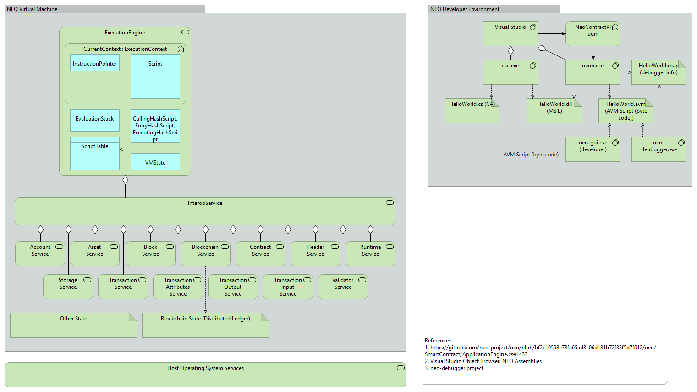
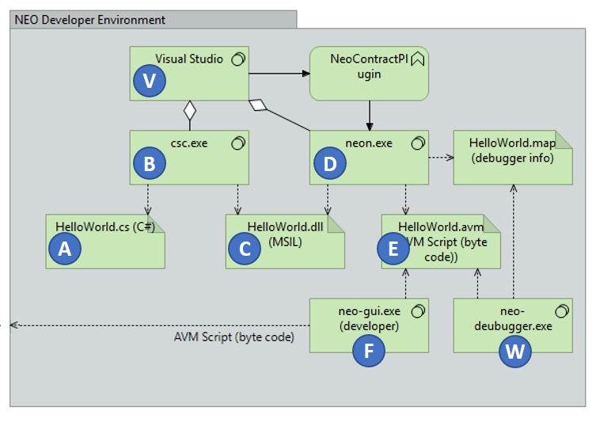

# NEO Blockchain Architecture Reference Model (ARM) for .NET Developers (neo-charm) 1.0

NEO Blockchain Documentation for .NET Developers ([url](https://github.com/mwherman2000/neo-windocs/tree/master/windocs))

## Purpose

The purpose of this document is to document a (software) architecture reference model for the NEO Blockchain platform to enable .NET developers to become more knowledgeable about the NEO platform more quickly and more easily.

## Goals

* Document a (software) architecture reference model for the NEO Blockchain platform
* Enable .NET developers to become more knowledge about the NEO platform more quickly and more easily.

## Principles

* Provide reliable documentation: timely, accurate, visual, and complete
* Save as much of a person's time as possible

## Drivers

* Need in the NEO .NET developer community to have concise and easy-to-follow documentation to enable people to get up to speed developing NEO smart contracts in as short a time as possible

## Sidenote for Ethereum Smart Contract Developers

If you're coming from an ETH development background, you will be used to thinking of your smart contract (after it's deployed onto the blockchain) like an instance of a C++/C# class and you can invoke any of the contract's public methods and fields. 

In NEO smart contract development, most people follow a pattern of invoking a smart contract through the public `Main()` function. Using this pattern, NEO smart contracts are more like .NET/C# console applications where the operating environment invokes function Main and passes in the arguments to the function (metaphorically, like command line parameters). This will evolve but this is a common pattern today. Here's an example from  the[neo-project/examples-csharp](https://github.com/neo-project/examples-csharp/blob/master/Domain/Domain.cs#L7) project:
```csharp
public static object Main(string operation, params object[] args)
{
    switch (operation)
    {
        case "query":
            return Query((string)args[0]);
        case "register":
            return Register((string)args[0], (byte[])args[1]);
        case "transfer":
            return Transfer((string)args[0], (byte[])args[1]);
        case "delete":
            return Delete((string)args[0]);
        default:
            return false;
    }
}
```

**NOTE:** In NEO smart contracts, public fields in a class are not automatically visible/callable unless you specifically write some accessor code of your own.

**NOTE:** Be careful using C# `switch` statements in NEO smart contracts [[TODO](TODO)].

## Motivation

When you're learning to write NEO smart contracts, you're really learning how to program the NEO VM to do what you want; for example, 
* perform a calculation
* read persisted data (state) from the blockchain
* add new data (state) to the blockchain
* verify someone's identity (and, in turn, determine which roles and permissions they have with respect to the purpose and goals of your smart contract)
* etc.

As an analogy, learning to program the NEO VM is like learning to fly a flight simulator.

-1024.jpg)

Figure 1. Sukhoi SuperJet Full Flight Simulator [credit: [Wikipedia](https://en.wikipedia.org/wiki/Full_flight_simulator#/media/File:SSJ100_FFS_1_(9318513805).jpg)]

In a flight simulator cockpit, the pilot is manipulating the controls (foot pedals, switches and knobs as well as the control column) and the simulator, in turn, receives those stimuli and causes multiple subsystems to respond and create an illusion that you are controlling a sophisticated aircraft. The subsystems responsible for creating these illusions include visual displays, audio cues and sound effects, hydraulic actuators, dials and other instruments.

A NEO smart contract running in the NEO VM is like the pilot in control of the flight simulator. The smart contract is performing various calculations and calling various virtual machine APIs to accomplish the smart contract's purpose and goals. In response to these API calls, the VM is interacting with its various subsystems (just like the flight simulator). In the case of the NEO VM, these subsystems include: 
* Account management
* Asset management
* Block management
* Blockchain management
* Contract management
* Header management
* Runtime management
* Storage management
* Transaction management
* Attribute management
* Input management
* Output management
* Validation management

...in addition to the [basic execution engine capabilities](http://docs.neo.org/en-us/sc/tutorial.html) such as:
* Flow control
* Stack operations (including parameter passing)
* Bit operations
* Arithmetic operations
* Logical operations
* Data type conversion
* Cryptographic operations
* Etc.

As a smart contract developer, it is your responsibility to learn and understand the purpose and goals each of the VM subsystems, the use cases they support, and best practices and programming patterns to use when developing best-in-class smart contacts.

## NEO Blockchain Architecture Reference Model (ARM)

The following diagram depicts in the architecture reference model (ARM) for the NEO Blockchain. It consists of two main components:

* NEO Developer Environment
* NEO Virtual Machine 


Figure 2. NEO Blockchain Architecture Reference Model

### NEO Developer Environment

The architecture of the NEO environment from a developer perspective is illustrated in the following diagram. This diagram was inspired by the [Relfos/neo-debugger-tools](https://github.com/Relfos/neo-debugger-tools) project.


Figure 3. NEO Developer Environment

The following table describes the key components of the NEO developer environment.

| Mark | Name | Description |
|:----:|:--------------- | ----------------------------------------|
|  | HelloWorld.cs | Smart contract source (example) 
|  | csc.exe | C# Compiler
|  | HelloWorld.dll | Smart contract compiled assembly (MSIL)
|  | neon.exe |NEO Transcompiler (debugger version)
|  | HelloWorld.avm | NEO VM script file (NEO byte code script)
|  | neo-gui (developer) | Smart contract deployment and testing tool
|  | Visual Studio | Microsoft .NET/C# IDE
|  | neo-debugger | Interactive source and byte code level debugger

Table 1. NEO Developer Environment

### NEO Virtual Machine

The architecture of the NEO Virtual Machine (NEO VM) is illustrated in the following diagram.


Figure 4. NEO Virtual Machine Architecture

The following table describes the key components of the NEO VM.

| Mark | Name | Description | Namespaces/APIs Callable by a Smart Contract |
|:----:|:--------------- |:--------------- | ----------------------------------------|
|  | NEO VM | Virtual machine major components and services | -
|  | ExecutionEngine | Execution enging components | `Neo.SmartContract.Framework.Services.System.ExecutionEngine` class
|  | CurrentContext | Execution engine current context | -
|  | InstructionPointer | Execution engine current instruction pointer | -
|  | Script | Current smart contract script being executed | `Neo.SmartContract.Framework.SmartContract` class
|  | ExecutionStack | Execution engine data stack | -
|  | VMState | Virtual machine current state (HALT, FAULT, BREAK) | -
|  | ScriptTable | Virtual machine script table of callable scripts | -
|  | InteropService | Interop service layer for everything that isn't one of the basic execution engine capabilities (see above) | -
|  | Account Service | Account service | `Neo.SmartContract.Framework.Services.Neo.Account` class
|  | Asset Service | Asset service | `Neo.SmartContract.Framework.Services.Neo.Asset` class
|  | Block Service | Block service | `Neo.SmartContract.Framework.Services.Neo.Block` class
|  | Blockchain Service, Header Service | Blockchain and Header services | `Neo.SmartContract.Framework.Services.Neo.Blockchain` class, `Neo.SmartContract.Framework.Services.Neo.Header` class
|  | Contract Service | Contract service | `Neo.SmartContract.Framework.Services.Neo.Contract` class
|  | Runtime Service | Runtime service | `Neo.SmartContract.Framework.Services.Neo.Runtime` class
|  | Storage Service | Storage service | `Neo.SmartContract.Framework.Services.Neo.Storage` class
|  | Validator Service | Validator service | `Neo.SmartContract.Framework.Services.Neo.Validator` class
|  | Blockchain State | Distributed ledger | -

Table 2. NEO Virtual Machine

### NEO .NET Namespaces

The NEO .NET namespaces are illustrated below.


Figure 5. NEO Blockchain Architecture Reference Model (.NET namespaces)

## References

* [NEONAMESPACE] NEO Project, [NEO Namespace](http://docs.neo.org/en-us/sc/api/neo.html) from [http://docs.neo.org/en-us/sc/api/neo.html](http://docs.neo.org/en-us/sc/api/neo.html)
* [NEOSCAPI] NEO Project, [Smart Contract API Reference](http://docs.neo.org/en-us/sc/api.html) from [http://docs.neo.org/en-us/sc/api.html](http://docs.neo.org/en-us/sc/api.html)
* [NEONODEINTRO] NEO Project, [NEO node introduction](http://docs.neo.org/en-us/node/introduction.html) from [http://docs.neo.org/en-us/node/introduction.html](http://docs.neo.org/en-us/node/introduction.html)
* [NEOBUGGER] Relfos, [Relfos/neo-debugger-tools](https://github.com/Relfos/neo-debugger-tools) from [https://github.com/Relfos/neo-debugger-tools](https://github.com/Relfos/neo-debugger-tools)

## Other Good Resources

* [NEORPCSHARPCLIENT] City of Zion, [Neo-RPC-SharpClient](https://github.com/CityOfZion/Neo-RPC-SharpClient/blob/master/README.md) from [https://github.com/CityOfZion/Neo-RPC-SharpClient/blob/master/README.md](https://github.com/CityOfZion/Neo-RPC-SharpClient/blob/master/README.md)


