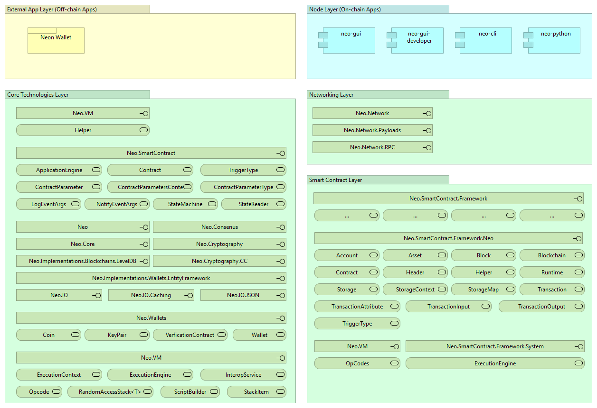

# NEO Blockchain Architecture Reference Model for .NET Developers (neo-charm)

NEO Blockchain Documentation for .NET Developers ([url](https://github.com/mwherman2000/neo-windocs/tree/master/windocs))

## Purpose

The purpose of this document is to document a (software) architecture reference model for the NEO Blockchain platform to enable .NET developers to become more knowledge about the NEO platform more quickly and more easily.

## Goals

* Document a (software) architecture reference model for the NEO Blockchain platform
* Enable .NET developers to become more knowledge about the NEO platform more quickly and more easily.

## Principles

* Provide reliable documentation: timely, accurate, visual, and complete
* Save as much of a person's time as possible

## Drivers

* Need in the NEO .NET developer community to have concise and easy-to-follow documentation to enable people to get up to speed developing NEO smart contracts in as short a time as possible

## NEO Blockchain Architecture Reference Model

## References

* [NEONAMESPACE] NEO Project, [NEO Namespace](http://docs.neo.org/en-us/sc/api/neo.html) from [http://docs.neo.org/en-us/sc/api/neo.html](http://docs.neo.org/en-us/sc/api/neo.html)
* [NEOSCAPI] NEO Project, [Smart Contract API Reference](http://docs.neo.org/en-us/sc/api.html) from [http://docs.neo.org/en-us/sc/api.html](http://docs.neo.org/en-us/sc/api.html)
* [NEONODEINTRO] NEO Project, [NEO node introduction](http://docs.neo.org/en-us/node/introduction.html) from [http://docs.neo.org/en-us/node/introduction.html](http://docs.neo.org/en-us/node/introduction.html)

## Other Good Resources

* [NEORPSHARPCLIENT] City of Zion, [Neo-RPC-SharpClient](https://github.com/CityOfZion/Neo-RPC-SharpClient/blob/master/README.md) from ([https://github.com/CityOfZion/Neo-RPC-SharpClient/blob/master/README.md])

