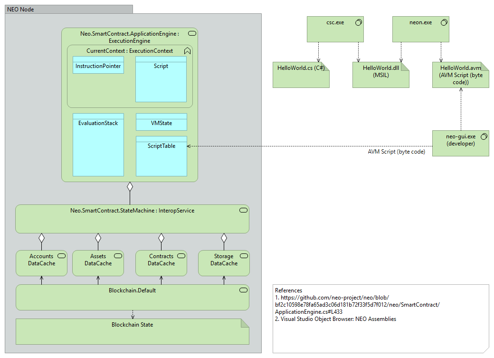

# NEO Blockchain Architecture Reference Model for .NET Developers (neo-charm) [WORK-IN-PROGRESS]

NEO Blockchain Documentation for .NET Developers ([url](https://github.com/mwherman2000/neo-windocs/tree/master/windocs))

## Purpose

The purpose of this document is to document a (software) architecture reference model for the NEO Blockchain platform to enable .NET developers to become more knowledge about the NEO platform more quickly and more easily.

## Goals

* Document a (software) architecture reference model for the NEO Blockchain platform
* Enable .NET developers to become more knowledge about the NEO platform more quickly and more easily.

## Principles

* Provide reliable documentation: timely, accurate, visual, and complete
* Save as much of a person's time as possible

## Drivers

* Need in the NEO .NET developer community to have concise and easy-to-follow documentation to enable people to get up to speed developing NEO smart contracts in as short a time as possible

## Sidenote for Ethereum Smart Contract Developers

If you're coming from an ETH dev background, you will be used to thinking of your smart contract (after it's deployed onto the blockchain) like an instance of a C++/C# class and you can invoke any of the contract's public methods and fields. 

In NEO smart contract development, most people follow a pattern of invoking a smart contract through the public `Main()` function. Using this pattern, NEO smart contracts are more like .NET/C# console applications where the operating environment invokes function Main and passes in the arguments to the function (metaphorically, like command line parameters). This will evolve but this is a common pattern today.

**NOTE:** In NEO smart contracts, public fields in a class are not automatically visible/callable unless you specifically write some accessor code of your own.

## NEO Blockchain Architecture Reference Model

When you're learning to write NEO smart contracts, you're really learning how to program the NEO VM to do what you want; for example, 
* perform a calculation
* read persisted data (state) from the blockchain
* add new data (state) to the blockchain
* verify someone's identity (and, in turn, determine which roles and permissions they have with respect to the purpose and goals of your smart contract)
* etc.

As an analogy, learning to program the NEO VM is like learning to fly a flight simulator.

-1024.jpg)

Figure 1. Sukhoi SuperJet Full Flight Simulator [credit: [Wikipedia](https://en.wikipedia.org/wiki/Full_flight_simulator#/media/File:SSJ100_FFS_1_(9318513805).jpg)]

In a simulator cockpit, the pilot is manipulating the controls (foot pedals, switches and knobs as well as the control column) and the simulator, in turn, receives those stimuli and causes multiple subsystems to respond and create an illusion that you are controlling a sophisticated aircraft. The subsystems responsible for creating these illusions include visual displays, audio cues and sound effects, hydraulic actuators, dials and other instruments.

A NEO smart contract running in the NEO VM is like the pilot in control of the flight simulator. The smart contract is performing various calculations and calling various virtual machine APIs to accomplish the smart contract's purpose and goals. In response to these API calls, the VM is interacting with its various susbsystems (just like the flight simulator). In the case of the NEO VM, these subsystems include: 
* Account management
* Asset management
* Smart contract management
* Storage management

...in addition to the [more basic computational operations](http://docs.neo.org/en-us/sc/tutorial.html):
* Flow control
* Stack operations
* Bit operations
* Arithmetic operations
* Logical operations
* Data type conversion
* Cryptographic methods
* Etc.

As a smart contract developer, it is your responsbility to learn and understand the purpose and goals each of the VM subsystems, the use cases they sypport, and best practices and programming patterns to use when developing best-in-class smart contacts.

The architecture of the NEO VM is illustrated in the following diagram.

Figure 2. NEO Blockchain Architecture Reference Model (subsystems)

 Some Stuff

 Some Stuff

 Some Stuff

The collection of .NET namespaces supported by the NEO VM susbsystems is illustrated below.

Figure 3. NEO Blockchain Architecture Reference Model (.NET namespaces)

## References

* [NEONAMESPACE] NEO Project, [NEO Namespace](http://docs.neo.org/en-us/sc/api/neo.html) from [http://docs.neo.org/en-us/sc/api/neo.html](http://docs.neo.org/en-us/sc/api/neo.html)
* [NEOSCAPI] NEO Project, [Smart Contract API Reference](http://docs.neo.org/en-us/sc/api.html) from [http://docs.neo.org/en-us/sc/api.html](http://docs.neo.org/en-us/sc/api.html)
* [NEONODEINTRO] NEO Project, [NEO node introduction](http://docs.neo.org/en-us/node/introduction.html) from [http://docs.neo.org/en-us/node/introduction.html](http://docs.neo.org/en-us/node/introduction.html)

## Other Good Resources

* [NEORPCSHARPCLIENT] City of Zion, [Neo-RPC-SharpClient](https://github.com/CityOfZion/Neo-RPC-SharpClient/blob/master/README.md) from ([https://github.com/CityOfZion/Neo-RPC-SharpClient/blob/master/README.md])

