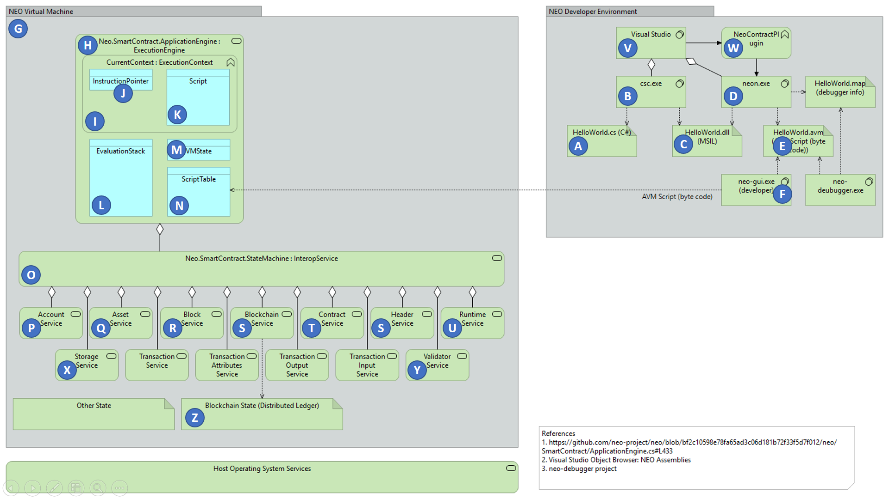

# C# Smart Contract Developers Guide

NEO Blockchain Documentation for .NET Developers ([url](https://github.com/mwherman2000/neo-windocs/tree/master/windocs))

## Appendix A - NEO Object Model Overview

### Purpose

TODO

### Goals, Non-Goals and Assumptions

TODO

### Principles

TODO

### Drivers

TODO

## NEO Object Model Overview

### NEO Blockchain Architecture Reference Model

The NEO .NET namespaces are illustrated below.

Figure A.1. NEO Blockchain Architecture Reference Model (.NET namespaces)

The architecture of the NEO environment is illustrated in the following diagram. This diagram was inspired by the [Relfos/neo-debugger-tools](https://github.com/Relfos/neo-debugger-tools) project.

Figure A.2. NEO Blockchain Architecture Reference Model (subsystems)

### NEO Developer Environment

The following table describes the key components of the NEO developer environment.

| Mark | Name | Description |
|:----:|:--------------- | ----------------------------------------|
|  | HelloWorld.cs | Smart contract source (example) 
|  | csc.exe | C# Compiler
|  | HelloWorld.dll | Smart contract compiled assembly (MSIL)
|  | neon.exe |NEO Transcompiler (debugger version)
|  | HelloWorld.avm | NEO VM script file (NEO byte code script)
|  | neo-gui (developer) | Smart contract deployment and testing tool
|  | Visual Studio | Microsoft .NET/C# IDE
|  | neo-debugger | Interactive source and byte code level debugger

Table A.1. NEO Developer Environment

### NEO Virtual Machine

| Mark | Name | Description | Namespaces/APIs Callable by a Smart Contract |
|:----:|:--------------- |:--------------- | ----------------------------------------|
|  | NEO VM | Virtual machine major components and services | -
|  | ApplicationEngine | Execution enging components | -
|  | CurrentContext | Execution engine current context | -
|  | InstructionPointer | Execution engine current instruction pointer | -
|  | Script | Current smart contract script being executed | `Neo.SmartContract.Framework.SmartContract`
|  | ExecutionStack | Execution engine data stack | -
|  | VMState | Virtual machine current state (HALT, FAULT, BREAK) | -
|  | ScriptTable | Virtual machine script table of callable scripts | -
|  | InteropService | Interop service layer for everything that isn't one of the basic execution engine capabilities (see above) | -
|  | Account Service | Account service | `Neo.SmartContract.Framework.Services.Neo.Account`
|  | Asset Service | Asset service | `Neo.SmartContract.Framework.Services.Neo.Asset`
|  | Block Service | Block service | `Neo.SmartContract.Framework.Services.Neo.Block`
|  | Blockchain Service, Header Service | Blockchain and Header services | `Neo.SmartContract.Framework.Services.Neo.Blockchain`, `Neo.SmartContract.Framework.Services.Neo.Header`
|  | Contract Service | Contract service | `Neo.SmartContract.Framework.Services.Neo.Contract`
|  | Runtime Service | Runtime service | `Neo.SmartContract.Framework.Services.Neo.Runtime`
|  | Storage Service | Storage service | `Neo.SmartContract.Framework.Services.Neo.Storage`
|  | Validator Service | Validator service | `Neo.SmartContract.Framework.Services.Neo.Validator`
|  | Blockchain State | Distributed ledger | -

Table A.2. NEO Virtual Machine

TODO 

## References

[NEOARM] mwherman200, [NEO Blockchain Architecture Reference Model](https://github.com/mwherman2000/neo-windocs/blob/master/windocs/neo-charm/README.md#neo-blockchain-architecture-reference-model) from [https://github.com/mwherman2000/neo-windocs/blob/master/windocs/neo-charm/README.md#neo-blockchain-architecture-reference-model](https://github.com/mwherman2000/neo-windocs/blob/master/windocs/neo-charm/README.md#neo-blockchain-architecture-reference-model)

