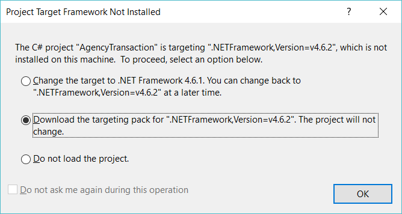
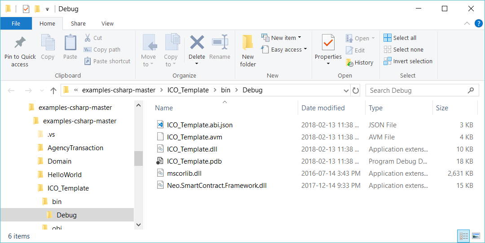
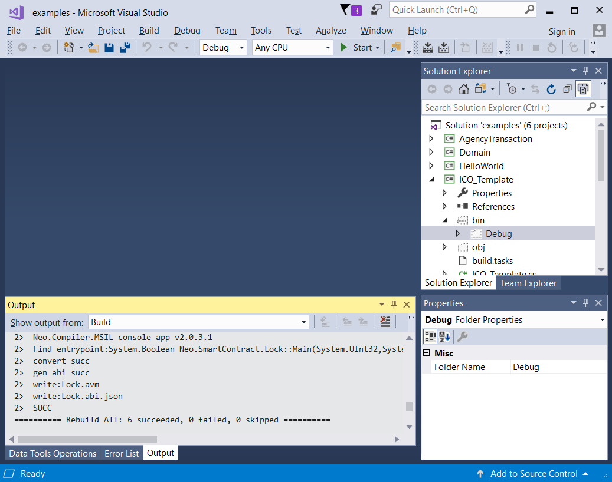

# Problems compiling ICO-Template smart contract in the [neo-project/examples-csharp](https://github.com/neo-project/examples-csharp) project

Project: [https://github.com/neo-project/examples-csharp](https://github.com/neo-project/examples-csharp)

1. When you open the project for the first time, you might be asked to download the .NET v4.6.2 developer pack.

    

2. Select the second option and download the .NET v4.6.2 from the Microsoft web site and install it on your local computer. (You may have to click on a redirection link.)

3. Close and reopen Visual Studio.  Reopen the project.

4. Rebuild the solution.  You're going to run into another problem.  It will look something like:
    >System.Action3<System.Byte[],System.Byte[],System.Numerics.BigInteger>.maybe it is System.Action which is defined in mscorlib.dll，copy this dll in.`
    
    You need to copy `mscorlib.dll` from
    ```
    C:\Program Files (x86)\Reference Assemblies\Microsoft\Framework\.NETFramework\v4.6.2
    ```
    into your project's `bin/Debug` folder; for example:
    ```
    C:\NEO\examples-csharp-master\examples-csharp-master\ICO_Template\bin\Debug
    ```

    

5. Rebuild your solution and you should be ready to go.

    

6. Smile :-)

## References

* [ICOTEMPLATEMSCORLIB] [ICO-Template project: mscorlib.dll build error (with a fix/workaround)](https://github.com/CityOfZion/neo-debugger-tools/issues/30) from [https://github.com/CityOfZion/neo-debugger-tools/issues/30](https://github.com/CityOfZion/neo-debugger-tools/issues/30)

## Feedback
* >"After a clean re-install of VS2017, re-pulling and then applying your 'hack', it is compiling again... You da freakin' man!  Thank you sir."

