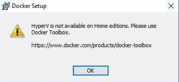
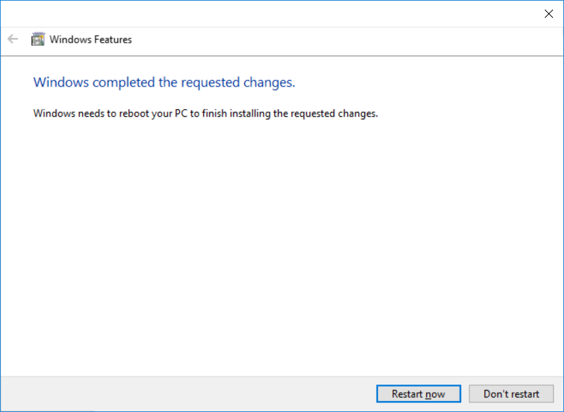
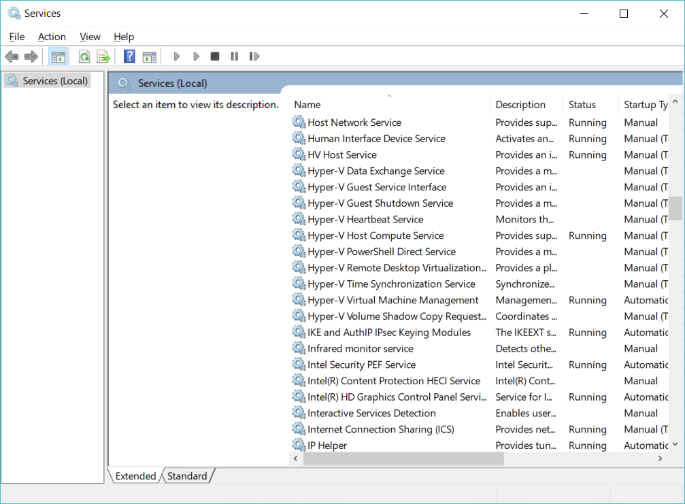
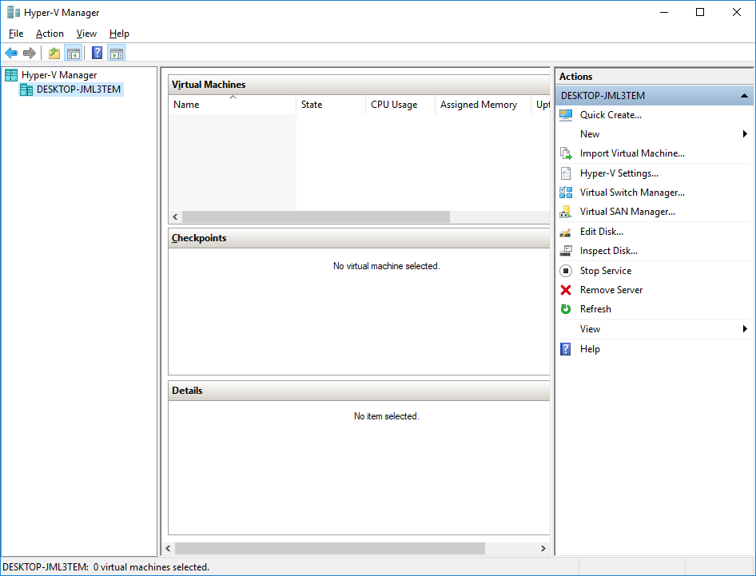
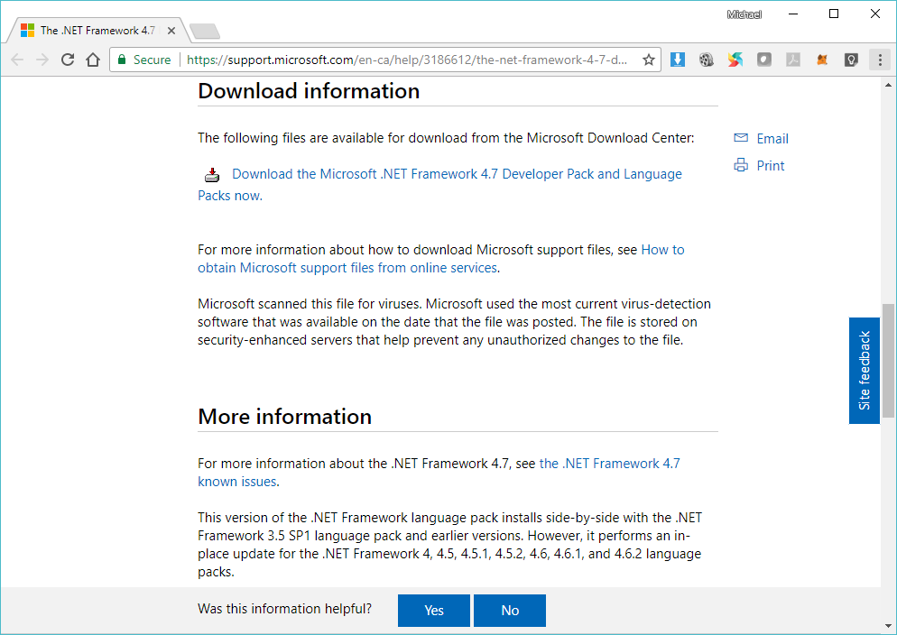
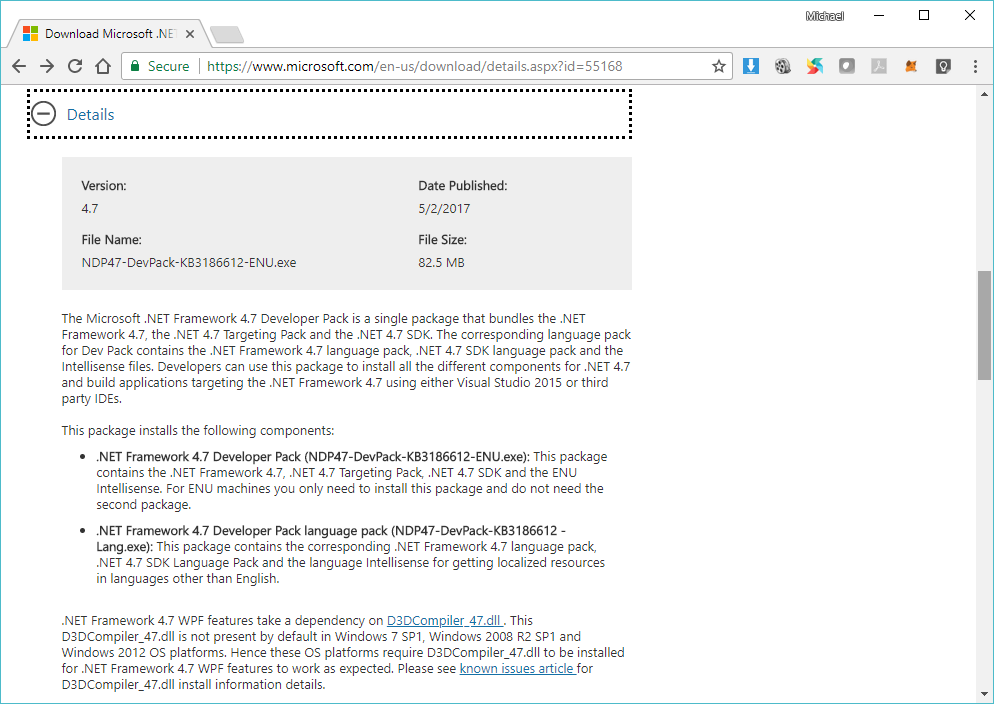
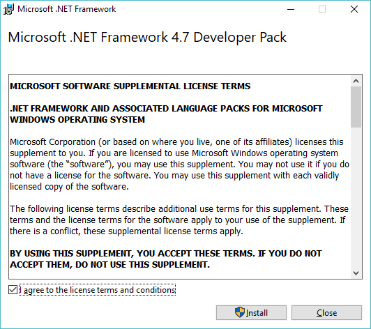
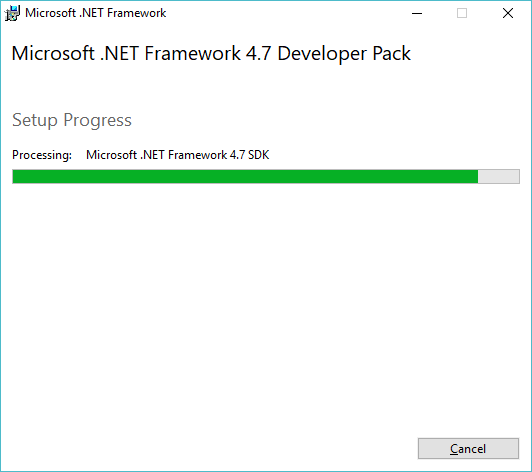
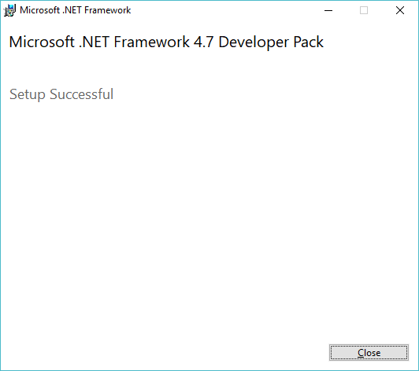

# NEO Blockchain Quick Start Guide for .NET Developers

NEO Blockchain Documentation for .NET Developers ([url](https://github.com/mwherman2000/neo-windocs/tree/master/windocs))

## Activity 0 - Prerequisites and Recommendations

### Purpose

The purpose of this activity is to for you to ensure you have Windows environment that is compatible with the list of 10 activities described in this document (and to save you a lot of time if your environment isn't compatible).  

### Goals, Non-Goals and Assumptions

The goal of this activity is to inform you about the minimum and recommended pre-requisites for successful execution of the remaining acitivities in Quick Start Guide for Windows .NET Developers.

### Principles

* Provide reliable documentation: timely, accurate, visual, and complete
* Save as much of a person's time as possible

### Drivers

* Lack of an existing set of concise and easy to follow documentation

## Prerequisites and Recommendations

The basic hardware and software prerquisites are that you have a computer (PC or laptap) with:
* Microsoft Windows 10 64-bit **Pro**, Enterprise and Education edition operating system (1607 Anniversary Update, Build 14393 or later)
  > The current version of Docker for Windows runs on 64bit Windows 10 Pro, Enterprise and Education (1607 Anniversary Update, Build 14393 or later). [[DOCKER](https://docs.docker.com/docker-for-windows/install/)]
  
  Windows 10 Home edition can't be used because it doesn't include the Hyper-V feature and hence, the Hyper-V service can't be installed/enabled and the NEO Docker container can't be use for deploying and testing NEO smart contracts. The Hyper-V service is a pre-requisite for installing Docker.
  
    

    Figure 0.1. Windows 10 Home edition doesn't include the Hyper-V feature

  **NOTE:** If you want to use a fresh clean Windows 10 Enterprise edition (Evaluation - Build 201712) enviroment (and you are running the Hyper-V service on your physical computer), consider downloading and running the "Windows 10 Dev Environment" virtual macine image.  If is available for the following hypervisors: VMWare, Hyper-V, VirtualBox, and Parallels.  Checkout [https://developer.microsoft.com/en-us/windows/downloads/virtual-machines](https://developer.microsoft.com/en-us/windows/downloads/virtual-machines).

* Latest Windows Updates installed
* 8GB of RAM (16GM or more prefered because you need to install and enable the Hyper-V feature and service)
* 50GB of free disk space (100GB ore preferred because you will eventually have multiple copies of the NEO blockchain files downloaded on to your machine)
* An SSD (solid state drive) is preferred over a conventional hard drive (HDD) for perfomance reasons but it's not a necessity

The activities in this document were tested with the following configurations:
* Windows 10 Pro edition Levnovo laptop, 32GB RAM, 500GB SSD + 500GB HDD, Intel i7 processor, Virtualization Technology enabled in BIOS
  * The installation succeeded
* Windows 10 Enterprise edition (Evaluation - Build 201712) virtual machine (referred to above), 2GB RAM
  * Only the Docker installation was tested and it **did not** succeed.  Not all of the required Hyper-V services were available for Docker to start without failing.
  * The Visual Studio installation requires a key (no evaluation key is provided with the VM)
* Windows 10 Home edition HP laptop, 8GB RAM, 1TB HDD, Intel i5 processor, Virtualization Technology enabled in BIOS
  * The installation failed because Windows 10 Home edition doesn't include the Hyper-V feature and hence, the service can't be installed/enabled and the NEO Docker container can't be use for deploying and testing NEO smart contracts.

## Create your NEO Working Folder

This folder will be used for all of your NEO development work.  It is the folder where you will download and build various NEO developer tools to as well as where you might choose for your own NEO solutions.

1. In Windows Explorer/File Manager or using the Command Prompt or Powershell, create youe local "NEO" folder:

    `C:\NEO`

    This is the recommended folder name but you can choose an alternate folder as well.

    **NOTE:** Some of the path names used in the NEO Project projects can be quite long.

## Install the Hyper-V Service on your Windows 10 computer

2. Inspect the Virtualization Technology setting in your computer's BIOS by starting Windows Task Manager and selecting the `Performance` tab; then select `CPU`. 

    

    Figure 0.2. Task Manager: Inspect the BIOS Virtualization Technology Setting (Disabled)

3. In Task Manager, if the `Virtualization` setting is Disabled, you need to power down computer; then restart it - pressing `F10` to enter the BIOS Setup Utility (similar to the following). Change the `Virtualization Technology` setting to `Enabled`; save and exit from the BIOS Setup Utility.  Reboot your commputer.

    

    Figure 0.3. BIOS Setup Utility: Virtualization Technology Setting (change to Enabled; then save and reboot)

4. To verify the Virtualization Technology setting in your computer's BIOS is Enabled, login to your computer and start Windows Task Manager again; selecting the `Performance` tab; then select `CPU`. `Virtualization` should now be `Enabled`.

    

    Figure 0.4. Task Manager: Verify the BIOS Virtualization Technology Setting (Enabled)

5. To install the Hyper-V service, click the Windows start menu and type "Turn Windows Features on or off". Scroll down until you find Hyper-V and select it (a checkmark should appear in the box). If the the Hyper-V box is already checked, then the Hyper-V service is already installed and you **don't* have to change this setting.

    

    Figure 0.5. Windows Features: Turn Windows Features on or off

    If you don't see the Hyper-V feature in the list at all, it is likely because you are running Windows 10 Home edition on your computer.  Find a computer with Windows 10 Pro, Enterprise or Academic edition or upgrade the operating system on your computer to one of these versions of Windows 10.

    

    Figure 0.6. Windows Features: Windows 10 Home edition doesn't include the Hyper-V feature

    If you insist on trying to continue, you're eventually going to run into this blocking problem in Activity 6 - Download, install, and test Docker platform. Stop now while you're ahead.

    

    Figure 0.7. Windows Features: HyperV is not available in Home editions

6. After selecting th Hyper-V feature and clicking OK, the following page will be displayed. Restart your computer to complete the installation of the the Hyper-V service.

    

    Figure 0.8. Windows Features: Restarting your computer

7. To verify the Hyper-V service is running, click the Windows start menu and enter "services.msc". You should see numerous Hyper-V services listed in the Services control panel.

    

    Figure 0.9. Services Control Panel: Hyper-V Services

8. Similarly, click the Windows start menu and enter `hyper-v manager`. Click the `Hyper-V Manager` app when it appears. Select your computer name.  

    

    Figure 0.10. Hyper-V Manager

9. This completes the installation and testing of the Hyper-V service.

## Download and Install the Microsoft .NET 4.7 Developer Pack

The .NET 4.7 Dev Pack is required to be able to build some components in the NEO developer toolset. If you overlook this step, Visual Studio will interupt and prompt to install this dev pack when it is required.

10. Download the .NET 4.7 Dev Pack starting here: [https://support.microsoft.com/en-ca/help/3186612/the-net-framework-4-7-developer-pack-and-language-packs](https://support.microsoft.com/en-ca/help/3186612/the-net-framework-4-7-developer-pack-and-language-packs)

    

    Figure 0.11. Microsoft Knowlege Base: The .NET Framework 4.7 Developer Pack and Language Packs

11. This will take you to the Microsoft Downloads site for the dev pack: [https://www.microsoft.com/en-us/download/details.aspx?id=55168](https://www.microsoft.com/en-us/download/details.aspx?id=55168). Scroll down and click the Download button to download the installer executable. 

    

    Figure 0.12. Microsoft Downloads site: Microsoft .NET Framework 4.7 Developer Pack and Language Packs for Windows 7 SP1, Windows 8.1, Windows 10 Anniversary Update, Windows Server 2008 R2 SP1, Windows Server 2012, Windows Server 2012 R2 and Windows Server 2016

12. Go to your Downloads folder on your computer and double-click the `NDP47-DevPack-KB3186612-ENU.exe` executable.
13. Click OK to run as Adminstrator for the installation process.

    

    Figure 0.13. .NET 4.7 Dev Pack EULA

14. The install process will start.

    

    Figure 0.14. .NET 4.7 Dev Pack Installation

15. The following page will be displayed when the installation is complete.

    

    Figure 0.15. .NET 4.7 Dev Pack Installation Complete

The tasks for this activity are complete. Proceed to [Activity 1 - Download and install Visual Studio 2017 Community Edition integrated development environment (IDE)](./01-installvisualstudio.md).

## References

* [DOCKER] docker.com, [Install Docker for Windows](https://docs.docker.com/docker-for-windows/install/) from [https://docs.docker.com/docker-for-windows/install/] (https://docs.docker.com/docker-for-windows/install/)
* [DEVPACK1] [The .NET Framework 4.7 Developer Pack and Language Packs](https://support.microsoft.com/en-ca/help/3186612/the-net-framework-4-7-developer-pack-and-language-packs) from [https://support.microsoft.com/en-ca/help/3186612/the-net-framework-4-7-developer-pack-and-language-packs](https://support.microsoft.com/en-ca/help/3186612/the-net-framework-4-7-developer-pack-and-language-packs)
* [DEVPAK2] [Microsoft .NET Framework 4.7 Developer Pack and Language Packs for Windows 7 SP1, Windows 8.1, Windows 10 Anniversary Update, Windows Server 2008 R2 SP1, Windows Server 2012, Windows Server 2012 R2 and Windows Server 2016](https://www.microsoft.com/en-us/download/details.aspx?id=55168) from [https://www.microsoft.com/en-us/download/details.aspx?id=55168](https://www.microsoft.com/en-us/download/details.aspx?id=55168)
