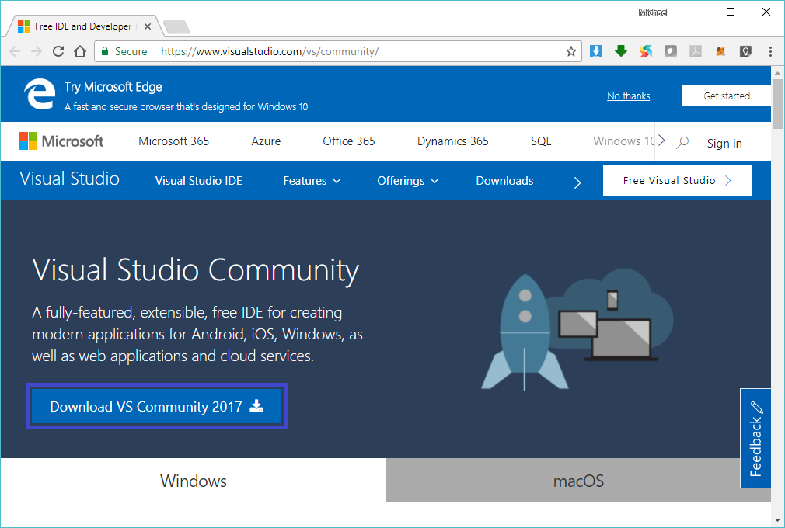
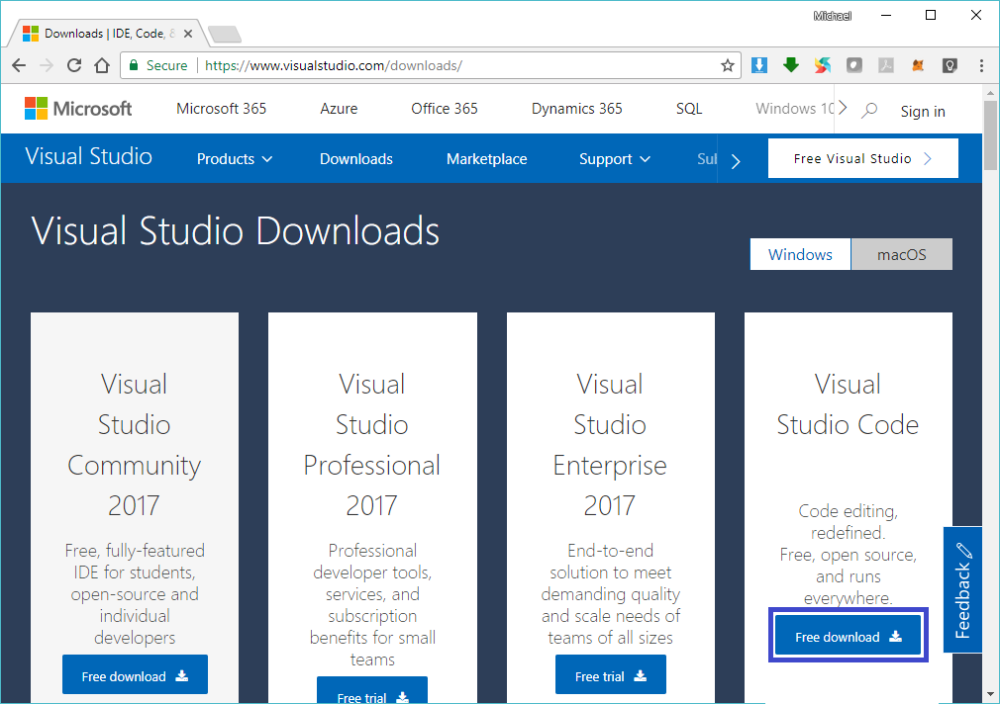
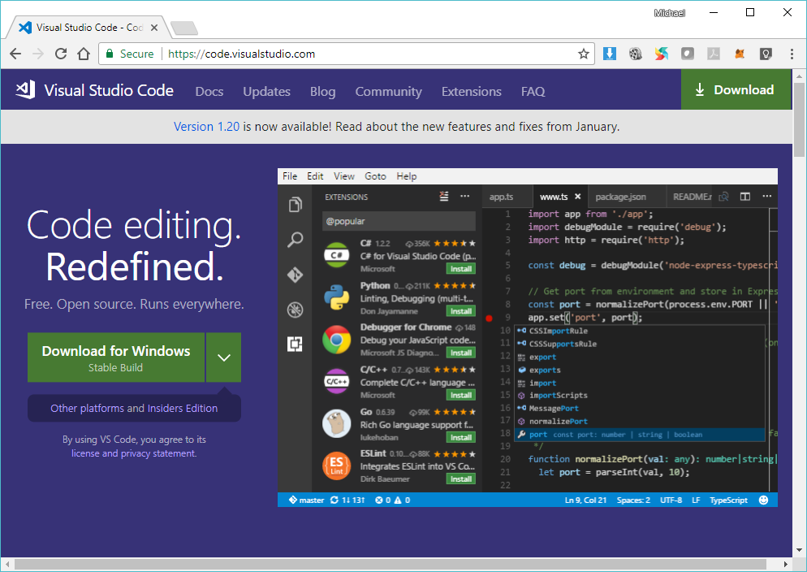

# NEO Blockchain Quick Start Guide for .NET Developers

NEO Blockchain Documentation for .NET Developers ([url](https://github.com/mwherman2000/neo-windocs/tree/master/windocs))

## Activity 1 - Download and install Visual Studio 2017 Community Edition integrated development environment (IDE)

### Purpose

The purpose of this activity is to download, install and perform basic configuration Visual Studio 2017 Community Edition if you don't already have an existing version of Visual Studio 2017 installed.

### Goals, Non-Goals and Assumptions

* Ensure you have a working and properly configured version of Visual Studio 2017 installed

Any additional Visual Studio customization steps are decribed in subsequent activities.

Visual Studio 2017 will install side-by-side with previous versions/editions of Visual Studio without affecting them (other than reducing your free disk space). This includes Visual Studio 2015 and Visual Studio Code, etc.

### Principles

* Provide reliable documentation: timely, accurate, visual, and complete
* Save as much of a person's time as possible
* Use open source software whenever possible

### Drivers

* Need in the NEO .NET developer community to have concise and easy-to-follow documentation to enable people to get up to speed developing NEO smart contracts in as short a time as possible

## Download and install Visual Studio 2017 Community Edition integrated development environment (IDE)

There are 2 scenarios:
* Scenario 1 - You don't have any version of Visual Studio 2017 installed
* Scenario 2 - You have an existing verson of Visual Studio 2017 installed

If Scenario 1 applies to you, you need to perform the tasks in Scenario 1 and then skip Scenario 2.

If only scenario 2 applies to you, you can skip the tasks in Scenario 1 and only perform the tasks in Scenario 2.

In addition, it is quite useful to have the Visual Studio Code installed on your computer. The installation and configuration of Visual Studio Code is documented as Scenario 3 and is optional but recommended.
>> **Visual Studio Code** is a code editor redefined and optimized for building and debugging modern web and cloud applications. Visual Studio Code is free and available on your favorite platform - Linux, Mac OSX, and Windows. [[VSCODE](https://code.visualstudio.com/)]

### Scenario 1 - You don't have any version of Visual Studio 2017 installed

1. Download the Visual Studio 2017 installer from either of:
   * [Generic Visual Studio downloads site (all editions)](https://www.visualstudio.com/downloads/) ([https://www.visualstudio.com/downloads/](https://www.visualstudio.com/downloads/))

     
  
     Figure 1.1. Generic Visual Studio downloads site (all editions)

   * [Visual Studio Community Edition specific download site](https://www.visualstudio.com/vs/community/) ([https://www.visualstudio.com/vs/community/](https://www.visualstudio.com/vs/community/)).

     
  
     Figure 1.2. Visual Studio Community Edition specific download site

2. In your Downloads folder, double click on the `vs_community.exe` installer executable.

3. Accept the Visual Studio EULA.

    

    Figure 1.3. Accept the Visual Studio EULA

4. Select the workloads (options) you want to use for your conventional front-end, middle-tier, and back-end components of your solution.
    
    

    Figure 1.4. Visual Studio Installer: Workloads

5. **IMPORTANT** Select the `.NET Core cross-platform development` toolset to enable compilation of all of the NEO developer tools.

    

    Figure 1.5. Visual Studio Installer: Toolsets

6. Click `Modify` to complete the installation.

7. Installation complete.

    

    Figure 1.6. Installation complete

8. Test the installation. From the Windows start menu, type "visual studio".  Select the Visual Studio app from the list. After a short delay, Visual Studio should start and look like something similar to the following.

    

    Figure 1.7. Test the installation

### Scenario 2 - You have an existing version of Visual Studio 2017 installed

If you have an existing version of Visual Studio 2017 installed, confirm that the required set of workloads and toolsets have been installed.

9. Start Visual Studio 2017

    

    Figure 1.8. Visual Studio 2017

10. In the Visual Studio toolbar, select `Tools > Get Tools and Features...`. The Visual Studio installer will start.

    

    Figure 1.9. Visual Studio Installer

11. Proceed to Task 4 (above) in Scenario 1 - You don't have any version of Visual Studio 2017 installed and complete the remaining tasks.

### Scenario 3 - (OPTIONAL) Installing and configuring Visual Studio Code

12. Download the Visual Studio Code installer from either of:
  * [Generic Visual Studio downloads site (all editions)](https://www.visualstudio.com/downloads/) ([https://www.visualstudio.com/downloads/](https://www.visualstudio.com/downloads/))

    
  
    Figure 1.10. Generic Visual Studio downloads site (all editions)

  * [Visual Studio Code specific download site](https://code.visualstudio.com) ([https://code.visualstudio.com](https://code.visualstudio.com)).

      
  
    Figure 1.11. Visual Studio Code specific download site

13. In your Downloads folder, double click on the `VSCodeSetup-x64-1.20.0.exe` installer executable.

14. Follow the default installation instructions to completion.

15. Test the installation. From the Windows start menu, type "visual studio code".  Select the Visual Studio Code app from the list.

The tasks for this activity are complete. Proceed to [Activity 2 - Download and unpack NEO developer tool projects (source)](./02-downloadneodevtoolsrc.md).

## References

* [[VSCODE](https://code.visualstudio.com/)] Microsoft, Microsoft Visual Studio Code web site
