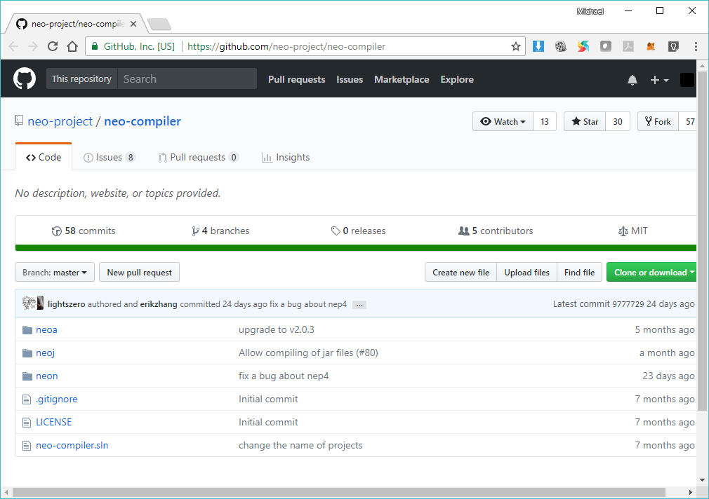
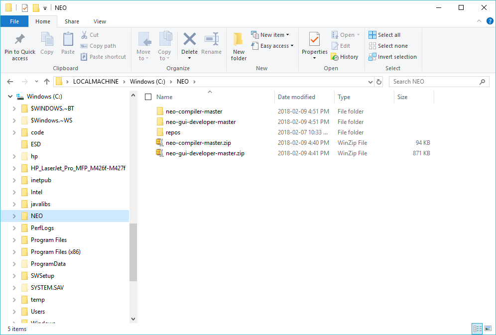

# NEO Blockchain Quick Start Guide for .NET Developers

NEO Blockchain Documentation for .NET Developers ([url](https://github.com/mwherman2000/neo-windocs/tree/master/windocs))

## Activity 2 - Download and unpack NEO developer tool projects (source)

### Purpose

The purpose of this activity is to download the NEO developer tool source projects while the Visual Studio installation running to completion.

### Goals, Non-Goals and Assumptions

* Ensure you have everything downloaded and installed before proceeding to the next set of activities
* Ensure you're able to get up and running is as short a time as possible

### Principles

* Provide reliable documentation: timely, accurate, visual, and complete
* Save as much of a person's time as possible
* Use open source software whenever possible

### Drivers

* Need in the NEO .NET developer community to have concise and easy-to-follow documentation to enable people to get up to speed developing NEO smart contracts in as short a time as possible

## Download and unpack the NEO developer tool sources

While Activity 1 - Download and install Visual Studio 2017 Community Edition integrated development environment (IDE) is completing, proceed to download and unpack the following 2 NEO Project projects to help you save time.

**NOTE:** Rather than downloading the source archive files, you may choose to `git clone` each of the 2 projects.  I leave that up to you. I'm just trying to keep things as simple as 

### Download and unpack the Neon NEO MSIL Transcompiler

1. Visit the Neon NEO transcompiler GitHub project at [https://github.com/neo-project/neo-compiler](https://github.com/neo-project/neo-compiler).

   

   Figure 2.1. Neon NEO Transcompiler GitHub Project

2. Click `Clone or download` and then select `Download ZIP` to download an archive of the current version of the project's source code to your local NEO folder (i.e. `C:\NEO` or your alternate folder created in Activity 0 - Prerequisites and Recommendations). 

    **NOTE:** You will likely have to manually copy or move the ZIP archive file from your Downloads folder to your local NEO folder.

   

   Figure 2.2. Neon NEO Transcompiler Source Download

3. Unzip the archive file to save the source files into the subfolder (e.g. by default `C:\NEO\neo-compiler-master`).

### Download and unpack the Neo-Gui-Developer Node/Wallet

4. Visit the Neon NEO transcompiler GitHub project at [https://github.com/CityOfZion/neo-gui-developer](https://github.com/CityOfZion/neo-gui-developer).

   

   Figure 2.3. Neo-Gui-Developer Node/Wallet GitHub Project

5. Click `Clone or download` and then select `Download ZIP` to download an archive of the current version of the project's source code to your local NEO folder (i.e. `C:\NEO` or your alternate folder created in Activity 0 - Prerequisites and Recommendations).

    **NOTE:** You will likely have to manually copy or move the ZIP archive file from your Downloads folder to your local NEO folder.

   

   Figure 2.4. Neo-Gui-Developer Node/Wallet Source Download

4. Unzip the archive file to save the source files into a subfolder (e.g. by default `C:\NEO\neo-gui-developer-master`).

5. Your local NEO folder should look something like the following (without the `repos` subfolder).

   

   Figure 2.4. Local NEO Folder (e.g. C:\NEO)

The tasks for this activity are complete. Proceed to [Activity 3 - Coffee Time: Wait for previous activities to complete](./03-coffeetime-waitforprevactivities.md).

## References

* [NEON] NEO Project, [Neon NEO MSIL Transcompiler](https://github.com/neo-project/neo-compiler) from [https://github.com/neo-project/neo-compiler](https://github.com/neo-project/neo-compiler).
* [NEON] NEO Project, [hNeo-Gui-Developer Node/Wallet](https://github.com/CityOfZion/neo-gui-developer) from [hhttps://github.com/CityOfZion/neo-gui-developer](https://github.com/CityOfZion/neo-gui-developer).
