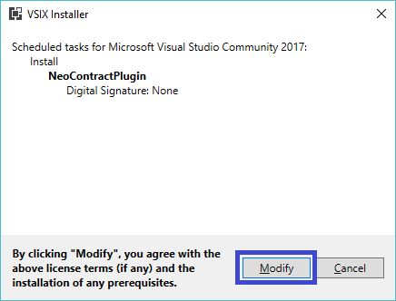
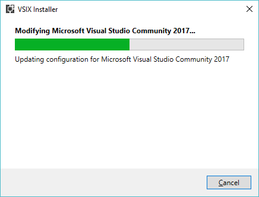

# NEO Blockchain Quick Start Guide for .NET Developers

NEO Blockchain Documentation for .NET Developers ([url](https://github.com/mwherman2000/neo-windocs/tree/master/windocs))

## Activity 4 - Install NeoContractPlugin Visual Studio extension

### Purpose

The purpose of this activity is to install the NeoContractPlugin extension into Visual Studio.

### Goals, Non-Goals and Assumptions

* Ensure you have a working and properly configured version of Visual Studio 2017 configured with the NeoContractPlugin installed in Visual Studio

### Principles

* Provide reliable documentation: timely, accurate, visual, and complete
* Save as much of a person's time as possible
* Use open source software whenever possible

### Drivers

* Need in the NEO .NET developer community to have concise and easy-to-follow documentation to enable people to get up to speed developing NEO smart contracts in as short a time as possible

## Install NeoContractPlugin Visual Studio extension

1. Start Visual Studio

    

    Figure 4.1. Visual Studio Home Screen

2. On the `Tools` menu, select `Extensions and Updates...` to display the following page. Select `Online`; then enter **NEO** in the Search box. A list similar to the following will be displayed.

    

    Figure 4.2. Search for NeoContractPlugin extension

3. To the right of the NeoContractPlugin extension, click `Download`.

    

    Figure 4.3. Download NeoContractPlugin extension

4. The following message will be displayed in the status area at the bottom of the page. This indicates that Visual Studio has scheduled the installation to occur in the background after you exit Visual Studio. Click `Close`on the page.

    

    Figure 4.4. NeoContractPlugin installation will be scheduled

5. Click the `Red X` to close Visual Studio. In a minute or two, the following page will be displayed indicating that the installation of the extension has started. Click `Modify`.

    

    Figure 4.5. NeoContractPlugin extension install confirmation

6. The installation of the extension will proceed.

    

    Figure 4.6. NeoContractPlugin extension installation progress

7. When the installation of the extension is complete, the following page will be displayed.

    

    Figure 4.7. NeoContractPlugin extension installation complete

## Testing NeoContractPlugin Visual Studio extension

* The NeoContractPlugin extension cannot be tested in Visual Studio until the NEO C# transcompiler has been build and configured. This is described in the next activity.  The NeoContractPlugin Visual Studio extension will be tested near the end of that activity.

The tasks for this activity are complete. Proceed to [Activity 5 - Build and test NEO developer tool projects (from source)](./05-buildneodevtools.md).

## References

* [NEOCONTRACTPLUGIN] NEO Project, [NEO Development Pack](https://github.com/neo-project/neo-devpack-dotnet) from [https://github.com/neo-project/neo-devpack-dotnet](https://github.com/neo-project/neo-devpack-dotnet)

