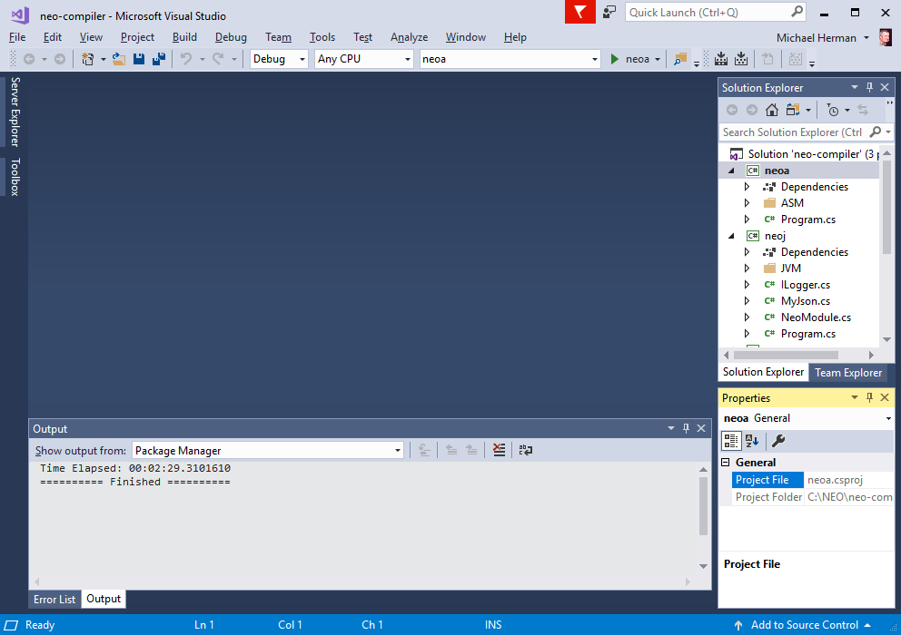
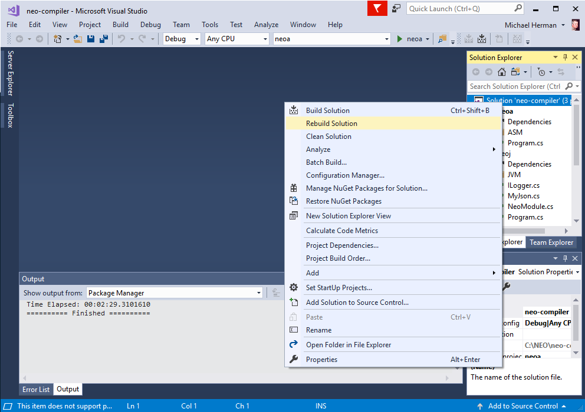
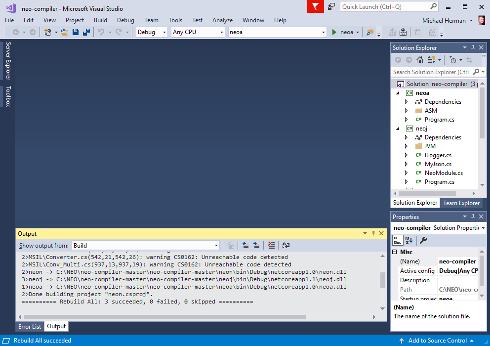
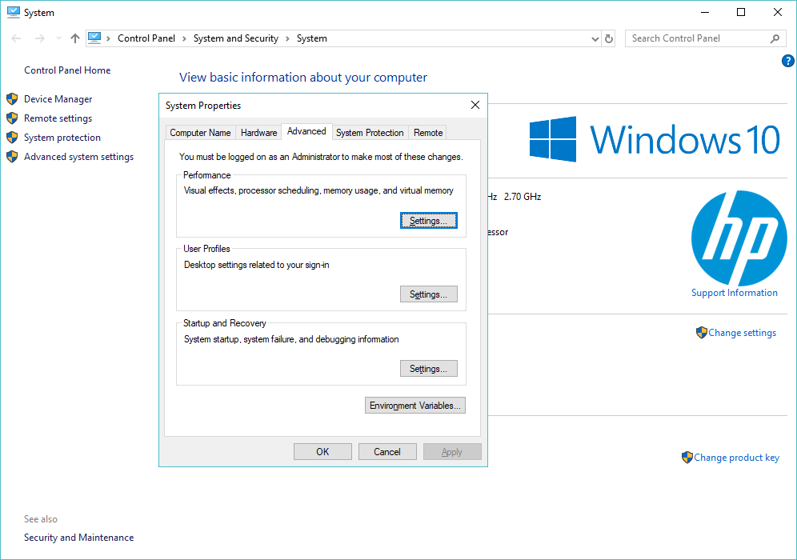
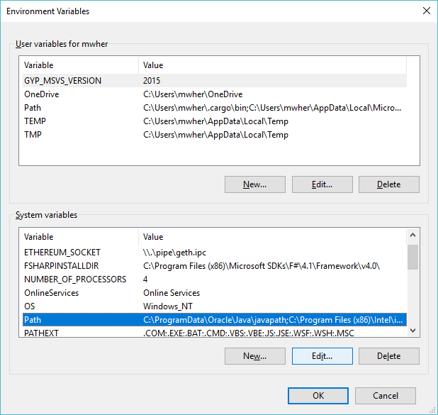
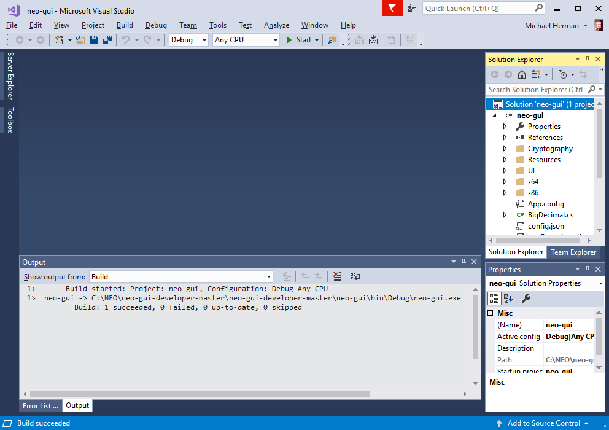
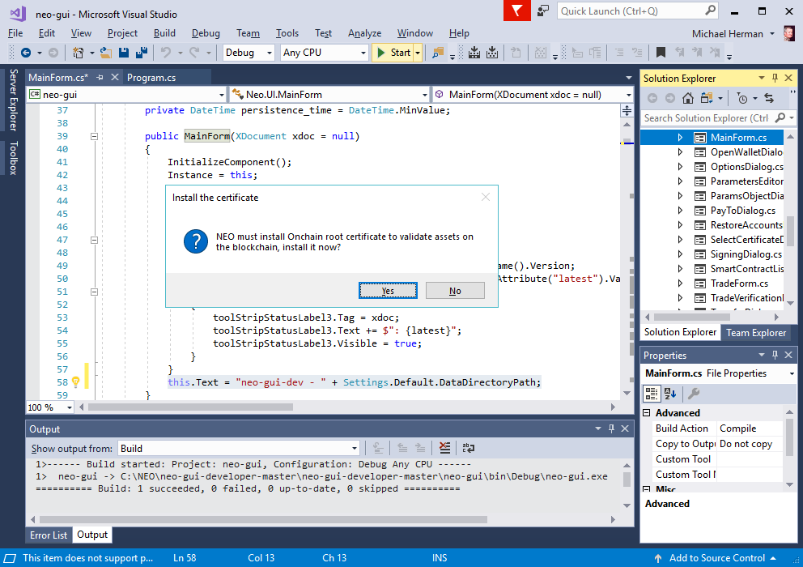

# NEO Blockchain Quick Start Guide for .NET Developers

NEO Blockchain Documentation for .NET Developers ([url](https://github.com/mwherman2000/neo-windocs/tree/master/windocs))

## Activity 5 - Build and test NEO developer tool projects (from source)

### Purpose

The purpose of this activity is to build the NEO developer tools from the sources downloaded and unpacked in the previous activity.

### Goals, Non-Goals and Assumptions

* Ensure you have a working and properly configured set of NEO developer tools for creating and building smart contracts in Visual Studio with the C# programming language

### Principles

* Provide reliable documentation: timely, accurate, visual, and complete
* Save as much of a person's time as possible
* Use open source software whenever possible

### Drivers

* Need in the NEO .NET developer community to have concise and easy-to-follow documentation to enable people to get up to speed developing NEO smart contracts in as short a time as possible

## Build and test NEO developer tool projects (from source)

### Build the Neon NEO MSIL Transcompiler

1. Open the neo-compiler project in Visual Studio by double-clicking `neo-compiler.sln` in the `C:\NEO\neo-compiler-master\neo-compiler-master` folder created in Activity 2 - Download and unpack NEO developer tool projects (source).

    

    Figure 5.1. Open `neo-compiler.sln` in Visual Studio 2017

2. Uncheck the message `Ask me for every project in this solution` and click `OK`.

    

    Figure 5.2. Visual Studio: Uncheck the message `Ask me for every project in this solution` and click `OK`

3. Visual Studio will open with the project displayed in the Solution Explorer to the right.

    

    Figure 5.3. Visual Studio: Solution Explorer

4. Right-click the solution name `neo-compiler` near the top of the Solution Explorer and select Rebuild Solution. Several things will happen the first time you do this; for example, the referenced Nuget packages will be downloaded and refreshed in addition to the sources being compiled to create the NEO compiler set.

    

    Figure 5.4. Visual Studio: Rebuild Solution

5. Rebuild Solution completes.

    

    Figure 5.5. Rebuild Solution completes

6. Right-click the project name `neon` in the Solution Explorer and select Publish.

    **NOTE:** This is the single most troublesome set of tasks in the entire Quick Start process.  Follow these manual workarounds carefully.

    

    Figure 5.6. `neon` Project: Publish...

7. The following Publish page will appear in Visual Studio. Select `Publish` on the left side (and not Connection Services). Click the `Publish` button to continue (using the default settings).

    

    Figure 5.7. `neon` Project: Publish to Folder

8. When you see "Publish failed", this is the problem area. Click `OK` to close this dialog box.

    

    Figure 5.8. `neon` Project: Published failed

9. In the Output pane at the bottom of the screen, change the drop down "Show output from:" from Build to `Build Order`. Note the highlighted error message about the missing neon.dll. It's not missing - it is in a different directory and needs to be manually copied to where Visual Studio expects to find this DLL.

    

    Figure 5.9. `neon` Project: neon.dll is missing (but not really)

10. Open Windows Explorer and navigate to the folder `C:\NEO\neo-compiler-master\neo-compiler-master\neon\bin\Release\netcoreapp1.0`. We need to copy `neon.dll` from this folder to the folder where Visual Studio expects to find it.

    

    Figure 5.10. `neon` Project folder:  `C:\NEO\neo-compiler-master\neo-compiler-master\neon\bin\Release\netcoreapp1.0`

11. Right-click on `neon.dll` and select `Copy`.

    

    Figure 5.11. `neon` Project folder: Copy `neon.dll` to the clipboard

12. In Windows Explorer, navigate to `C:\NEO\neo-compiler-master\neo-compiler-master\neon\obj\Release\netcoreapp1.0`. Right-click in the file list and select `Paste` to paste a copy of `neon.dll` into this folder.

    **NOTE:** This is the **obj/Release/netcoreapp1.0** folder path.

    

    Figure 5.12. `neon` Project folder:  `C:\NEO\neo-compiler-master\neo-compiler-master\neon\obj\Release\netcoreapp1.0`

13. Back in Visual Studio, click the `Publish` button to publish the `neon` project files a second time (using the default settings).

    

    Figure 5.13. `neon` Project: Republish the Project

14. This time, Publish completes successfully. 

    

    Figure 5.14. `neon` Project: Publish Succeeded

15. The `neon` project files have been published to `C:\NEO\neo-compiler-master\neo-compiler-master\neon\bin\Release\PublishOutput`. 

    **NOTE:** Remember this path because in the next set of tasks, we need to attend to the Windows `Path` search path environment variable.

    

    Figure 5.15. `neon` Project: PublishOutout Folder

At this point, the `neo-compiler` project has been built and published. The remaining tasks are to:
* Configure Windows `Path` search environment variable, and
* Test that the `neon` transcompiler works properly with a Visual Studio NEO smart contract project.

16. To configure the `Path` environment variable, from the Windows start menu, enter "system" and select the System control panel app. In the left pane, click `Advanced system settings` to display the `System Properties` dialog box. 

    

    Figure 5.16. Control Panel: System Properties

17. On the `System Properties` dialog box, click `Environment Variables...` to display the `Environment Variables` dialog box. Note the `Path` environment variable in the System variables section. Select `Path` and clck `Edit...`.

    

    Figure 5.17. Control Panel: System Properties: Environment Variables

18. Click `New` to add the PublishOutput path to the current list of folders in the `Path` environment variable. Use `C:\NEO\neo-compiler-master\neo-compiler-master\neon\bin\Release\PublishOutput` for the value of the new path. Click `OK` **twice** to close the 2 Environment Variables dialog boxed and return the the System control panel app.

    

    Figure 5.18. Control Panel: System Properties: `Path` Environment Variable

### Test the Neon NEO MSIL Transcompiler

19. We'll go step-by-step.  Firt, open a new Windows Command Prompt. Enter `Path` and press Enter to inspect the current value of the `Path` environment variable. You should be able to find the PublishOutput path in the list (closer to the end of the list but it isn't necessarily the very last element of the list).

    

    Figure 5.19. Command Prompt: `Path` Environment Variable

20. Open Visual Studio 2017 to create a new NEO smart contract project.

    

    Figure 5.20. Visual Studio 2017

21. Select `File` > `New` > `Project...` to open the New Project dialog box. Select `Visual C#`. Select `NeoContract`. Click `OK` to close this dialog box and create a new NeoContract solution and project in Visual Studio. 

    

    Figure 5.21. Visual Studio: Create a New NeoContract Project

22. Visual Studio may take a few minutes to create the NeoContract project.

    

    Figure 5.22. Visual Studio: Creating the NeoContract Project

23. Right-click on the NeoContract project folder and select `Build`. Note the highlighted messages in the Build section of the Output panel. These 2 message indicate the Visual Studio was able to create both the NEO virtual machine byte code file as well as the Application Binary Interace (ABI) file (in JSON format).

    **NOTE:** If you don't see these 2 messages, the most likely senarios are:
      * `neon.dll` wasn't published properly. Go back to Task 6 of this activity.
      * The `Path` environment variable was not set correctly. Go back to Task 16 of this activity.
      * You had opened Visual Studio before you set the `Path` environment variable.  Close Visual Studio and then go back to Task 20.

    

    Figure 5.23. Visual Studio: Building the NeoContract Project

### Build the Neo-Gui-Developer Node/Wallet

25. Open the neo-compiler project in Visual Studio by double-clicking `neo-gui.sln` in the `C:\NEO\neo-gui-developer-master\neo-gui-developer-master` folder created in Activity 2 - Download and unpack NEO developer tool projects (source).

    

    Figure 5.24. Open `neo-gui.sln` in Visual Studio 2017

25. Uncheck the message `Ask me for every project in this solution` and click `OK`.

    

    Figure 5.25. Uncheck the message `Ask me for every project in this solution` and click `OK`

26. Visual Studio will open with the project displayed in the Solution Explorer to the right.

    

    Figure 5.26. Visual Studio: Solution Explorer

27. (OPTIONAL) If you are comfortable making code changes to a Windows C# .NET Webforms application, navigate to the `Mainform.cs` source file in the `UI` folder. Right-click this file and select `View Code`. Scroll down to the MainForm() constructor method. At end of the constructor, add the highlighted single line of code:
    ```csharp
    this.Text - "neo-gui-dev - " + Settings.Default.DataDirectoryPath; 
    ```
    Type `ctrl+s` to save your changes to this source file. 
    This single line of code with display the blockchain database folder name in the app's title bar next to app's name. This is a useful practice when you're using multiple sets of JSON configuration files (more about these later).

    

    Figure 5.27. Optional source changes

### Test the Neo-Gui-Developer Node/Wallet

28. Still in Visual Studio with the `neo-gui.sln` solution open (developer version), click `Start` to run `neo-gui` with the Visual Studio debugger.

    

    Figure 5.28. `neo-gui`: Start with Visual Studio Debugger

29. If this is the very first time you have worked with a NEO project, you may be prompted to install a root certificate into the Windows certificate store. Click `Yes`.

    

    Figure 5.29. Accept NEO Root Certificate

30. The `neo-gui` (developer version) app should open and begin syncing with the NEO testnet network. You should see the block counts in the bottom-right corner increase over time as well as the the green progress bar begin to animate. Click Wallet > Exit to close the Neo-Gui-Developer Node/Wallet app.

    

    Figure 5.30. `neo-gui` (Developer Version) App


The tasks for this activity are complete. Proceed to [Activity 6 - Download, install, and test Docker platform](./06-installdockerplatform.md).

## References

* [NEOTUTORIAL] NEO Project, [NEO smart contract tutorial](http://docs.neo.org/en-us/sc/tutorial.html) from [http://docs.neo.org/en-us/sc/tutorial.html](http://docs.neo.org/en-us/sc/tutorial.html)
* [NEONCOMPILER] NEO Project, [Neon NEO MSIL Transcompiler](https://github.com/neo-project/neo-compiler) from [https://github.com/neo-project/neo-compiler](https://github.com/neo-project/neo-compiler).
* [NEOGUIDEVWALLET] NEO Project, [hNeo-Gui-Developer Node/Wallet](https://github.com/CityOfZion/neo-gui-developer) from [hhttps://github.com/CityOfZion/neo-gui-developer](https://github.com/CityOfZion/neo-gui-developer).
