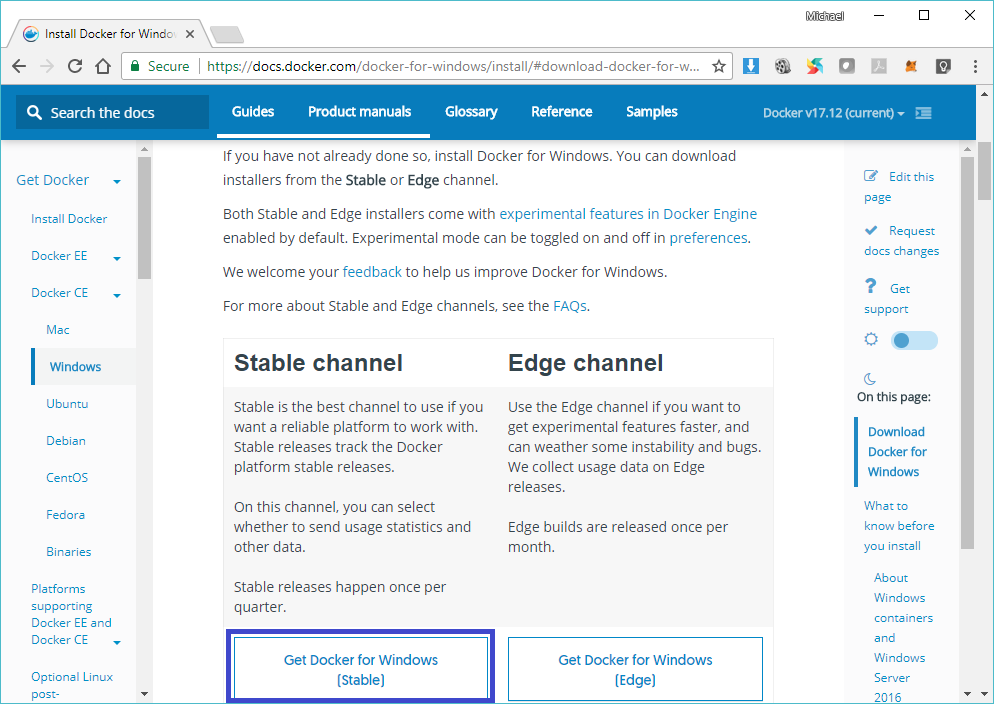
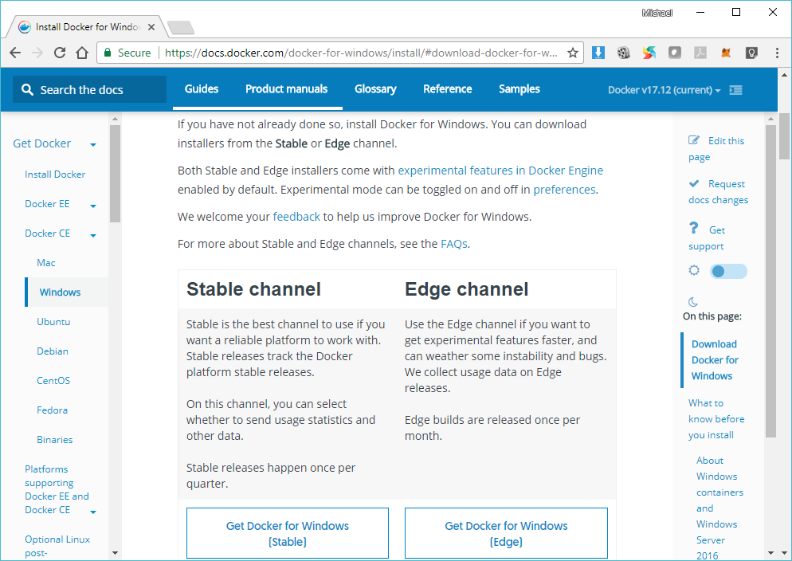
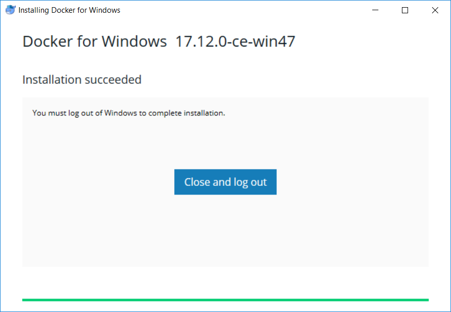
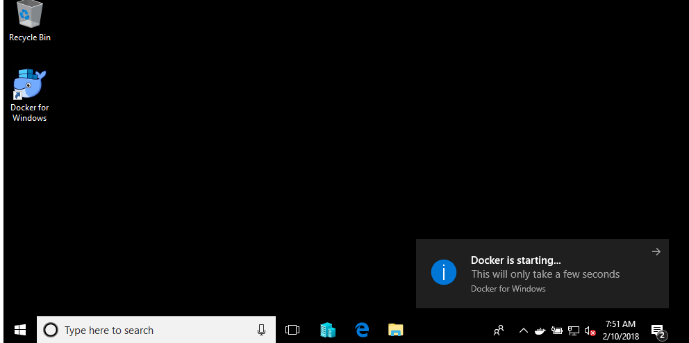
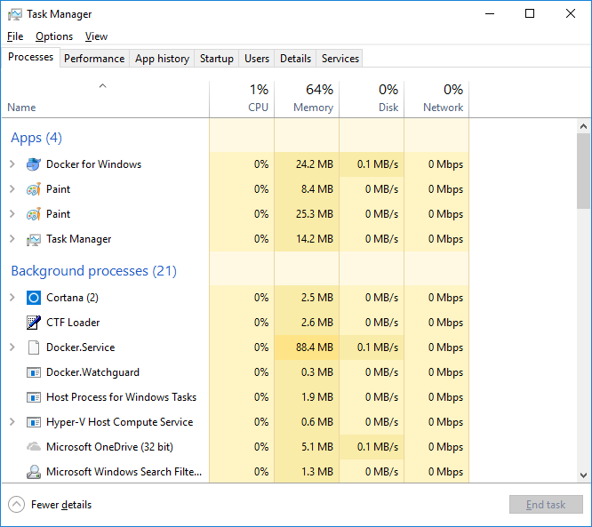
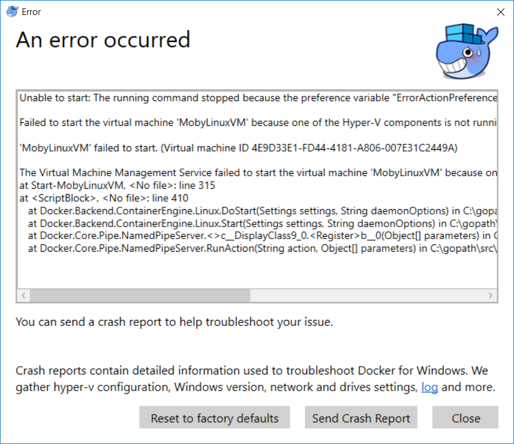
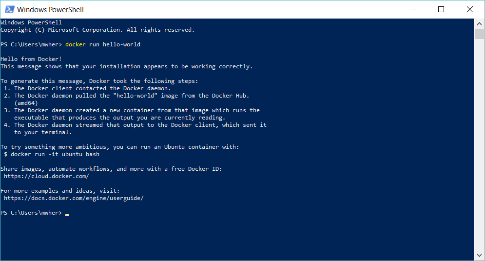

# NEO Blockchain Quick Start Guide for .NET Developers

NEO Blockchain Documentation for .NET Developers ([url](https://github.com/mwherman2000/neo-windocs/tree/master/windocs))

## Activity 6 - Download, install, and test Docker platform

### Purpose

The purpose of this activity is to download, install, and test the Docker container platform to in turn support the running of a local NEO private network (NEO privatenet).

### Goals, Non-Goals and Assumptions

* Ensure you have a working and properly configured set of NEO developer tools for creating and building smart contracts in Visual Studio with the C# programming language

### Principles

* Provide reliable documentation: timely, accurate, visual, and complete
* Save as much of a person's time as possible
* Use open source software whenever possible

### Drivers

* Need in the NEO .NET developer community to have concise and easy-to-follow documentation to enable people to get up to speed developing NEO smart contracts in as short a time as possible

## Download and install the Docker platform

1. Download the Docker for Windows (Stable version) installer from the [Docker for Windows download site](https://docs.docker.com/docker-for-windows/install/) ([https://docs.docker.com/docker-for-windows/install/](https://docs.docker.com/docker-for-windows/install/))

    
  
    Figure 6.1. Docker for Windows download site: Stable version

2. In your Downloads folder, double click on the `Docker for Windows Installer.exe` executable.

3. The installation will start.

    
  
    Figure 6.2. Docker Installation

4. When the installation completes, you will be asked to log out and login back into your computer.  (You may be asked to restart your computer.)

    
  
    Figure 6.3. Installation Completes

5. After you login in to your computer, Docker will start. If the Docker notification doesn't appear, you can double-clock the `Docker for Windows` icon on the desktop.

    
  
    Figure 6.4. Docker is Starting

    **NOTE:** The Docker "whale" icon that is display on the right-side of the Windows Taskbar.

## Test the Docker platform

6. In Windows Task Manager, you should see the Docker processes running

    
  
    Figure 6.5. Windows Task Manager: Docker Processes

7. In the Hyper-V Manager, you should see the `MobyLinuxVM` is installed and running.

    
  
    Figure 6.6. Hyper-V Manager: MobyLinuxVM Virtual Machine is Running

8. **NOTE:** If you are not running a valid version of Windows 10 or do not have the Hyper-V service installed properly, Docker may display a message similar to this one. Consult the [Docker for Windows web site](https://docs.docker.com/docker-for-windows/install/) for more assistance.

    
  
    Figure 6.7. Potential Docker for Windows Issues

9. Test Docker itself by starting Windows Powershell. From the Windows start menu, type "powershell".  Select the Windows Powershell app from the list.

    
  
    Figure 6.8. Docker Basic Testing

10. In the Powershell console, enter `docker run hello-world` (and press Enter).

    
  
    Figure 6.9. Docker Run Hello-World

11. The installation and testing of the Docker container platform is complete.

The tasks for this activity are complete. Proceed to [Activity 7 - Download, install and test NEO privatenet Docker container](./07-installneoprivatenetcontainer.md).

## References

* [DOCKER] docker.com, [Install Docker for Windows](https://docs.docker.com/docker-for-windows/install/) from [https://docs.docker.com/docker-for-windows/install/] (https://docs.docker.com/docker-for-windows/install/)

## Other Good Resources

* [NEOPYTHONTUTORIAL] Nick Fujita, [NEO Smart Contracts Tutorial: helloWorld (Python)](https://steemit.com/neo/@z0yo/neo-smart-contracts-tutorial-helloworld) from [https://steemit.com/neo/@z0yo/neo-smart-contracts-tutorial-helloworld](https://steemit.com/neo/@z0yo/neo-smart-contracts-tutorial-helloworld)
* [NEOPYTHONTUTORIALVIDEO] Nick Fujita, [NEO Smart Contract Tutorial - Hello World (Python)](https://www.youtube.com/watch?v=9Ha_5RdOQrA) from [https://www.youtube.com/watch?v=9Ha_5RdOQrA](https://www.youtube.com/watch?v=9Ha_5RdOQrA)

