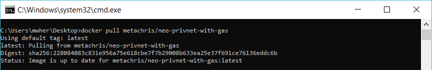
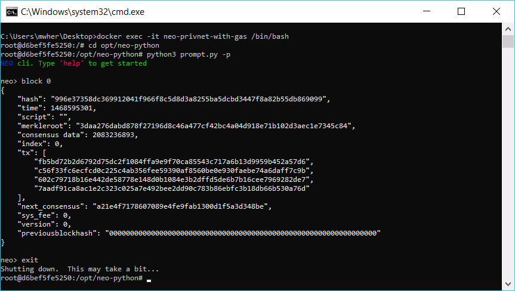

# NEO Blockchain Quick Start Guide for .NET Developers

NEO Blockchain Documentation for .NET Developers ([url](https://github.com/mwherman2000/neo-windocs/tree/master/windocs))

## Activity 7 - Download, install and test NEO privatenet Docker container

### Purpose

The purpose of this activity is to download, install and test the NEO private network (privatenet) Docker container using the Docker platform installed in the previous activity to insure we can build and deploy NEO smart contracts to privatenet.

### Goals, Non-Goals and Assumptions

* Ensure you have a working and properly configured set of NEO developer tools for creating and building smart contracts in Visual Studio with the C# programming language

### Principles

* Provide reliable documentation: timely, accurate, visual, and complete
* Save as much of a person's time as possible
* Use open source software whenever possible

### Drivers

* Need in the NEO .NET developer community to have concise and easy-to-follow documentation to enable people to get up to speed developing NEO smart contracts in as short a time as possible

## Download and install the NEO privatenet Docker Container

1. To ensure Docker is installed and running, start the Powershell console and enter `docker run hello-world` (and press Enter).

    
  
    Figure 7.1. Docker Run Hello-World

2. To download the NEO Docker container and run it, run the following script: 
    ```
    docker pull metachris/neo-privnet-with-gas
    docker run -d --name neo-privnet-with-gas -p 20333-20336:20333-20336/tcp -p 30333-30336:30333-30336/tcp metachris/neo-privnet-with-gas
    pause
    ```
    Script: NEO Docker Download/Install/Run  ([./scripts/neodockerinstall.bat.txt](./scripts/neodockerinstall.bat.txt))

    The script produces the following output:

    
  
    Figure 7.2. NEO Docker Download/Install/Run

## Test the NEO privatenet Docker Container

3. To test the NEO Docker container, run following script:
    ```
    REM cd opt/neo-python
    REM python3 prompt.py -p
    REM block 0
    docker exec -it neo-privnet-with-gas /bin/bash
    pause
    ```
    Script: NEO Docker Python CLI/Shell ([./scripts/neodockerpshell.bat.txt](./scripts/neodockerpshell.bat.txt))

4. The above script will open a bash console for the NEO container. Execute the following commands in the Bash console to start the NEO Python CLI:
    ```
    cd opt/neo-python
    python3 prompt.py -p
    ```

5. The above commands will start the NEO Python CLI. Execute the following commands to verify the NEO container (and NEO node) is working:
    ```
    block 0
    exit
    ```

    In total, the last 3 tasks produce the following output:

    
  
    Figure 7.3. NEO Docker Test

The tasks for this activity are complete. Proceed to [Activity 8 - Create and compile HelloWorld smart contract sample](./08-createcompilesmartcontract.md).

## Additional Notes

For a client app to access the NEO privatenet you just created, your NEO app will need to replace the 2 JSON configuration files with the contents of the following JSON files:

* config.json: ([./json/config.neodocker.json](./json/config.neodocker.json))
* protocol.json: ([./json/protocol.neodocker.json](./json/protocol.neodocker.json))

To switch over from an existing NEO network to this privatenet, make sure you:
* Delete your old blockchain database folder
* Delete your old `peers.dat` file
* Start neo-gui.exe
* Re-index your database

## Script Library

* NEO Docker Download/Install/Run ([./scripts/neodockerinstall.bat.txt](./scripts/neodockerinstall.bat.txt))
* NEO Docker Stop/Remove ([./scripts/neodockeruninstall.bat.txt](./scripts/neodockeruninstall.bat.txt))
* NEO Docker Start ([./scripts/neodockerstart.bat.txt](./scripts/neodockerstart.bat.txt))
* NEO Docker Stop ([./scripts/neodockerstop.bat.txt](./scripts/neodockerstop.bat.txt))
* NEO Docker Restart ([./scripts/neodockerrestart.bat.txt](./scripts/neodockerrestart.bat.txt))
* NEO Docker Reset ([./scripts/neodockerreset.bat.txt](./scripts/neodockerreset.bat.txt))
* NEO Docker Python CLI/Shell ([./scripts/neodockerpshell.bat.txt](./scripts/neodockerpshell.bat.txt))

## References

* [DOCKER] docker.com, [Install Docker for Windows](https://docs.docker.com/docker-for-windows/install/) from [https://docs.docker.com/docker-for-windows/install/] (https://docs.docker.com/docker-for-windows/install/)
* [NEODOCKER1] metachris, [metachris/neo-privnet-with-gas](https://hub.docker.com/r/metachris/neo-privnet-with-gas/) from [https://hub.docker.com/r/metachris/neo-privnet-with-gas/]https://hub.docker.com/r/metachris/neo-privnet-with-gas/()
* [NEODOCKER2] CityOfZion project, [CityOfZion/neo-privatenet-docker](https://github.com/CityOfZion/neo-privatenet-docker) from [https://github.com/CityOfZion/neo-privatenet-docker](https://github.com/CityOfZion/neo-privatenet-docker)
* [NEODOCKER3] Chris Haer, [How to run a private network of the NEO blockchain](https://medium.com/proof-of-working/how-to-run-a-private-network-of-the-neo-blockchain-d83004557359) from [https://medium.com/proof-of-working/how-to-run-a-private-network-of-the-neo-blockchain-d83004557359](https://medium.com/proof-of-working/how-to-run-a-private-network-of-the-neo-blockchain-d83004557359)
