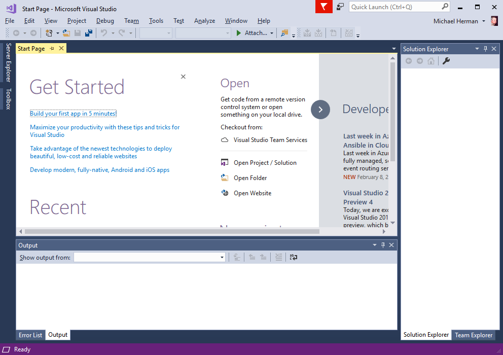
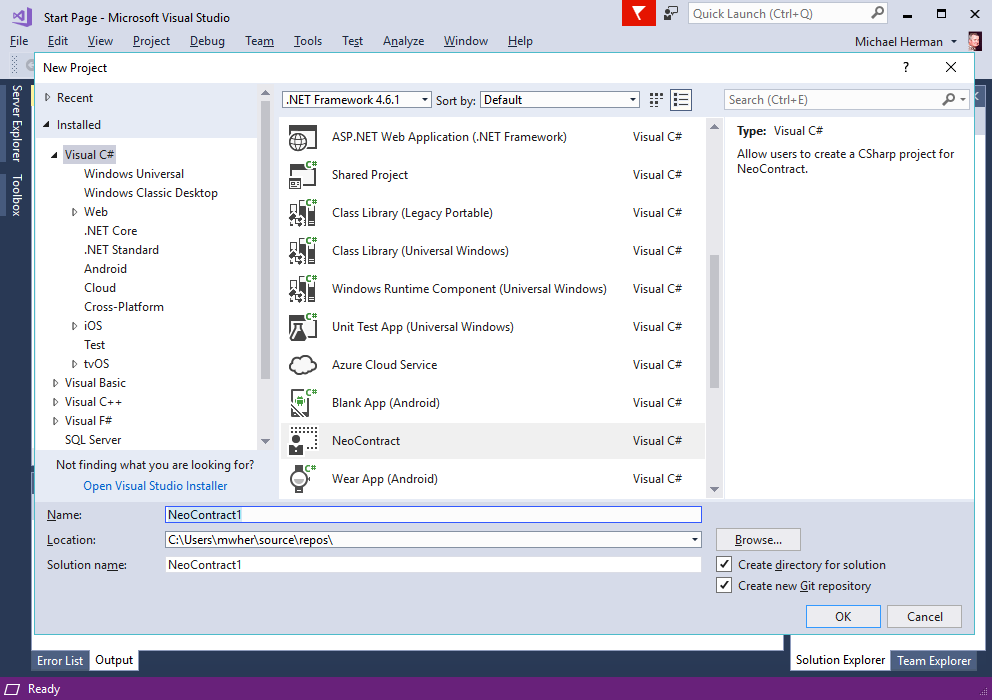
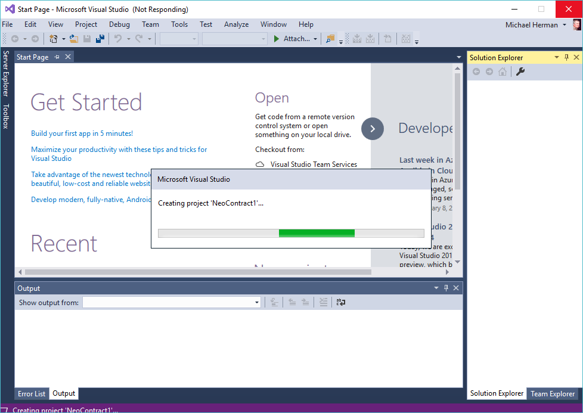
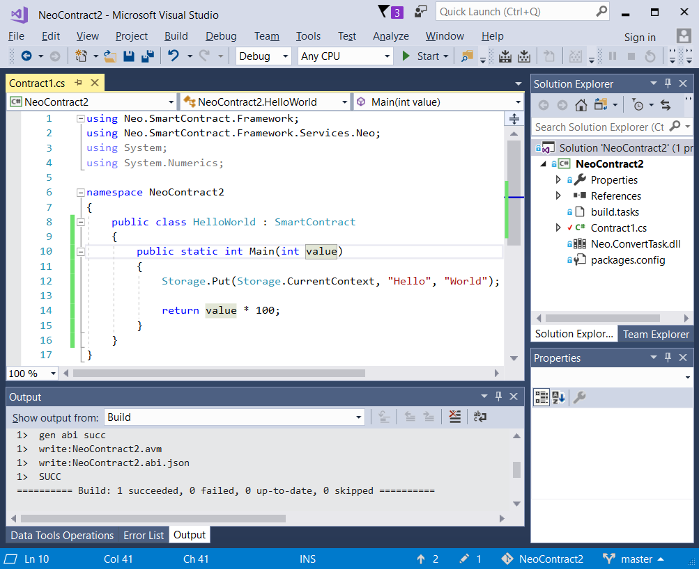

# NEO Blockchain Quick Start Guide for .NET Developers

NEO Blockchain Documentation for .NET Developers ([url](https://github.com/mwherman2000/neo-windocs/tree/master/windocs))

## Activity 8 - Create and compile HelloWorld smart contract sample

TODO

### Purpose

The purpose of this activity is to create and compile a variation of the Hello World C# smart contract sample to create the NEO VM byte code file (.avm byte code file). The compiled smart contract will be deployed and tested in the next activity.

### Goals, Non-Goals and Assumptions

* Ensure you have a working and properly configured set of NEO developer tools for creating and building smart contracts in Visual Studio with the C# programming language
* Non-goal: Learn about smart contract development. The goal is to simply get a sample smart contract working. More advanced documentation on creating smart contacts will be available elsewhere in the [mwherman2000/neo-windocs](https://github.com/mwherman2000/neo-windocs/tree/master/windocs) project.
* Non-goal: Learn C# programming. There are lots of resources on the Internet for this (e.g. [C# Fundamentals for Absolute Beginners](https://mva.microsoft.com/en-us/training-courses/c-fundamentals-for-absolute-beginners-16169?l=Lvld4EQIC_2706218949))

### Principles

* Provide reliable documentation: timely, accurate, visual, and complete
* Save as much of a person's time as possible
* Use open source software whenever possible

### Drivers

* Need in the NEO .NET developer community to have concise and easy-to-follow documentation to enable people to get up to speed developing NEO smart contracts in as short a time as possible

## Create and compile HelloWorld smart contract sample

1. Open Visual Studio 2017 to create a new NEO smart contract project.

    

    Figure 8.1. Visual Studio 2017

2. Select `File` > `New` > `Project...` to open the New Project dialog box. Select `Visual C#`. Select `NeoContract`. Click `OK` to close this dialog box and create a new NeoContract solution and project in Visual Studio. 

    

    Figure 8.2. Visual Studio: Create a New NeoContract Project

3. Visual Studio may take a few minutes to create the NeoContract project.

    

    Figure 8.3. Visual Studio: Creating the NeoContract Project

4. Once Visual Studio has created the project, it will look similar to the following. Right-click on the NeoContract project folder and select `Build`. Note the highlighted messages in the Build section of the Output panel. These 2 message indicate the Visual Studio was able to create both the NEO virtual machine byte code file as well as the Application Binary Interace (ABI) file (in JSON format).

    

    Figure 8.4. Visual Studio: Building the NeoContract Project

5. Replace the class `Contract1` with the following C# code from here [HelloWorld2.cs](./snippets/HelloWorld2.cs).
   ```csharp
   public class HelloWorld : SmartContract
   {
       public static int Main(int value)
       {
           Storage.Put(Storage.CurrentContext, "Hello", "World");

           return value * 100;
       }
   }
   ```

5. Right-click on the NeoContract project folder and select `Build`. Note the highlighted messages in the Build section of the Output panel. These 2 message indicate the Visual Studio was able to create both the NEO virtual machine byte code file as well as the Application Binary Interace (ABI) file (in JSON format).

   

    Figure 8.5. Hello World: Building the NeoContract Project

The tasks for this activity are complete. Proceed to [Activity 9 - Deploy and test HelloWorld smart contract](./09-deploytestsmartcontract.md).

## References

* [NEOTUTORIAL] NEO Project, [NEO smart contract tutorial](http://docs.neo.org/en-us/sc/tutorial.html) from [http://docs.neo.org/en-us/sc/tutorial.html](http://docs.neo.org/en-us/sc/tutorial.html)

