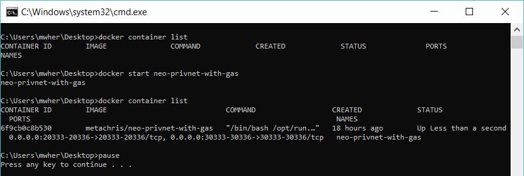
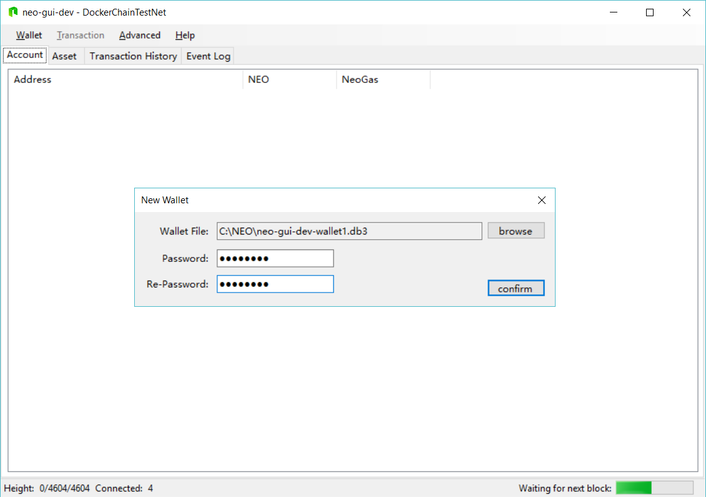
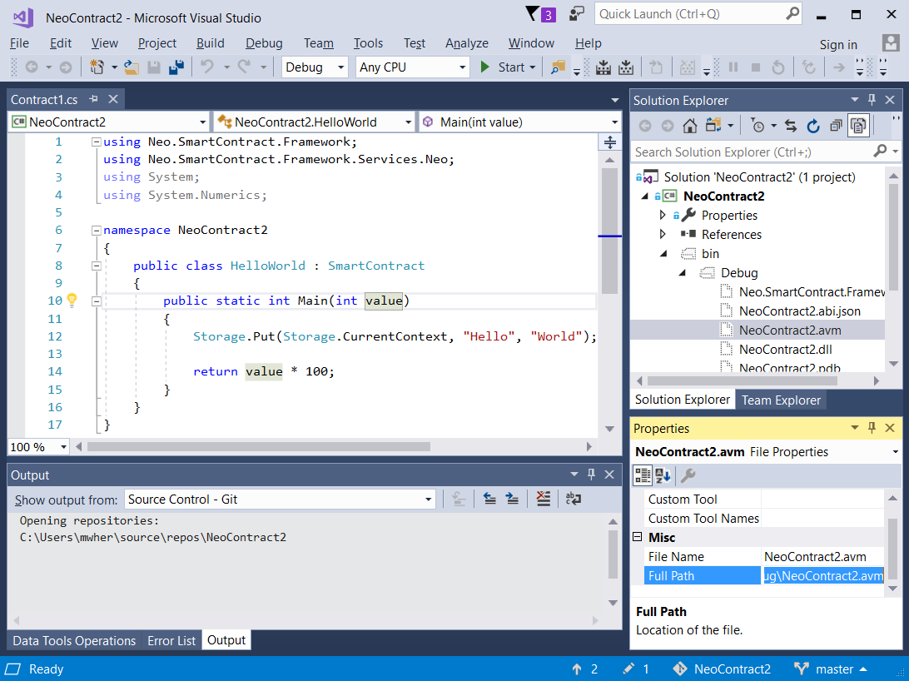

# NEO Blockchain Quick Start Process for .NET Developers

NEO Blockchain Documentation for .NET Developers ([url](https://github.com/mwherman2000/neo-windocs/tree/master/windocs))

## Activity 9 - Deploy and test HelloWorld smart contract

TODO

### Purpose

The purpose of this activity is to use deploy and test the HelloWorld smart contract created in the previous activity. It uses the the neo-gui-developer tool that was build in an earlier activity. This activity also uses the NEO Docker container that was installed and configured also in an earlier activity.

### Goals, Non-Goals and Assumptions

* Ensure you have a working and properly configured set of NEO developer tools for creating and building smart contracts in Visual Studio with the C# programming language

### Principles

* Provide reliable documentation: timely, accurate, visual, and complete
* Save as much of a person's time as possible
* Use open source software whenever possible

### Drivers

* Need in the NEO .NET developer community to have concise and easy-to-follow documentation to enable people to get up to speed developing NEO smart contracts in as short a time as possible

## Start (reset) the NEO privatenet Docker container

1. Start the NEO privatenet Docker container by opening PowerShell and running the following commands: 
    ```
    docker container list
    docker stop neo-privnet-with-gas
    docker container list
    docker rm neo-privnet-with-gas
    docker container list
    docker run -d --name neo-privnet-with-gas -p 20333-20336:20333-20336/tcp -p 30333-30336:30333-30336/tcp metachris/neo-privnet-with-gas
    docker container list
    pause
    ```
    Script: NEO Docker Reset ([./scripts/neodockerreset.bat.txt](./scripts/neodockerreset.bat.txt))

    The script produces the following output:

    
  
    Figure 9.1. NEO Docker Start

## Test the NEO privatenet Docker Container

2. To test the NEO Docker container, run following script:
    ```
    REM cd opt/neo-python
    REM python3 prompt.py -p
    REM block 0
    docker exec -it neo-privnet-with-gas /bin/bash
    pause
    ```
    Script: NEO Docker Python CLI/Shell ([./scripts/neodockerpshell.bat.txt](./scripts/neodockerpshell.bat.txt))

## Configure `neo-gui (developer)` to use the NEO privatenet Docker container

3. Open Windows Explorer and navigate to `TODO`:

    

    Figure 9.2. `neo-gui (developer)` bin/Debug Folder

4. TODO

    

    Figure 9.XXX. XXX

5. TODO

    

    Figure 9.XXX. XXX

6. TODO

    

    Figure 9.XXX. XXX

7. TODO

    

    Figure 9.XXX. XXX

8. TODO

    

    Figure 9.XXX. XXX

9. TODO

    

    Figure 9.XXX. XXX

10. TODO

    

    Figure 9.XXX. XXX

11. TODO

    

    Figure 9.XXX. XXX

12. TODO

    

    Figure 9.XXX. XXX

13. TODO

    

    Figure 9.XXX. XXX

14. TODO

    

    Figure 9.XXX. XXX

15. TODO

    

    Figure 9.XXX. XXX

16. TODO

    

    Figure 9.XXX. XXX

17. TODO

    

    Figure 9.XXX. XXX

18. TODO

    

    Figure 9.XXX. XXX

19. TODO

    

    Figure 9.XXX. XXX

20. TODO

    

    Figure 9.XXX. XXX

21. TODO

    

    Figure 9.XXX. XXX

22. TODO

    

    Figure 9.XXX. XXX

23. TODO

    

    Figure 9.XXX. XXX

24. TODO

    

    Figure 9.XXX. XXX

25. TODO

    

    Figure 9.XXX. XXX

26. TODO

    

    Figure 9.XXX. XXX

27. TODO

    

    Figure 9.XXX. XXX

28. TODO

    

    Figure 9.XXX. XXX

29. TODO

    

    Figure 9.XXX. XXX

30. TODO

    

    Figure 9.XXX. XXX

31. TODO

    

    Figure 9.XXX. XXX

32. TODO

    

    Figure 9.XXX. XXX
33. TODO

    

    Figure 9.XXX. XXX

34. TODO

    

    Figure 9.XXX. XXX

35. TODO

    

    Figure 9.XXX. XXX

36. TODO

    

    Figure 9.XXX. XXX

37. TODO

    

    Figure 9.XXX. XXX

38. TODO

    

    Figure 9.XXX. XXX

39. Configure `neo-gui (developer)` by replacing the 2 JSON configuration files with the contents of the following JSON files:

* config.json: ([./json/config.neodocker.json](./json/config.neodocker.json))
* protocol.json: ([./json/protocol.neodocker.json](./json/protocol.neodocker.json))

5. In addition, make sure you:
* Delete your old blockchain database folder
* Delete your old `peers.dat` file

6. TODO
* Start neo-gui.exe

7. TODO
* Re-index your database

8. Create a new wallet using the WIF key provided with the NEO Docker container documentation [NEODOCKER1](https://hub.docker.com/r/metachris/neo-privnet-with-gas/#Wallet). 
    ```
    WIF key: KxDgvEKzgSBPPfuVfw67oPQBSjidEiqTHURKSDL1R7yGaGYAeYnr
    Address: AK2nJJpJr6o664CWJKi1QRXjqeic2zRp8y
    ```

## Use `neo-gui (developer)` to deploy the HelloWorld smart contract

1. TODO

1. TODO

1. TODO

## Use `neo-gui (developer)` to invoke and test the HelloWorld smart contract

1. TODO

1. TODO

    Parameter/Return&nbsp;Type | Description |
    :--------|:---------------------- |
    Signature|00|
    Boolean|01|
    Integer|02|
    Hash160 (160-bit hash value)|03|
    Hash256 (256-bit hash value)|04|
    ByteArray|05|
    PublicKey|06|
    String|07|
    Array|10|
    InteropInterface|f0|   
    Void|ff|


1. TODO

The tasks for this activity are complete. Proceed to [Activity 10 - Celebrate](./10-celebrate.md).

## Script Library

* NEO Docker Start ([./scripts/neodockerstart.bat.txt](./scripts/neodockerstart.bat.txt))

## References

* [NEOTUTORIAL] NEO Project, [NEO smart contract tutorial](http://docs.neo.org/en-us/sc/tutorial.html) from [http://docs.neo.org/en-us/sc/tutorial.html](http://docs.neo.org/en-us/sc/tutorial.html)
* [NEODOCKER1] metachris, [metachris/neo-privnet-with-gas](https://hub.docker.com/r/metachris/neo-privnet-with-gas/) from [https://hub.docker.com/r/metachris/neo-privnet-with-gas/]https://hub.docker.com/r/metachris/neo-privnet-with-gas/()

## Other Good Resources

* [NEOPYTHONTUTORIAL] Nick Fujita, [NEO Smart Contracts Tutorial: helloWorld (Python)](https://steemit.com/neo/@z0yo/neo-smart-contracts-tutorial-helloworld) from [https://steemit.com/neo/@z0yo/neo-smart-contracts-tutorial-helloworld](https://steemit.com/neo/@z0yo/neo-smart-contracts-tutorial-helloworld)
* [NEOPYTHONTUTORIALVIDEO] Nick Fujita, [NEO Smart Contract Tutorial - Hello World (Python)](https://www.youtube.com/watch?v=9Ha_5RdOQrA) from [https://www.youtube.com/watch?v=9Ha_5RdOQrA](https://www.youtube.com/watch?v=9Ha_5RdOQrA)
