# NEO Blockchain Quick Start Guide for .NET Developers

NEO Blockchain Documentation for .NET Developers ([url](https://github.com/mwherman2000/neo-windocs/tree/master/windocs))

## Activity 9 - Deploy and test HelloWorld smart contract

### Purpose

The purpose of this activity is to use deploy and test the HelloWorld smart contract created in the previous activity. It uses the the neo-gui-developer tool that was build in an earlier activity. This activity also uses the NEO Docker container that was installed and configured also in an earlier activity.

### Goals, Non-Goals and Assumptions

* Ensure you have a working and properly configured set of NEO developer tools for creating and building smart contracts in Visual Studio with the C# programming language

### Principles

* Provide reliable documentation: timely, accurate, visual, and complete
* Save as much of a person's time as possible
* Use open source software whenever possible

### Drivers

* Need in the NEO .NET developer community to have concise and easy-to-follow documentation to enable people to get up to speed developing NEO smart contracts in as short a time as possible

## Start (reset) the NEO privatenet Docker container

1. Start the NEO privatenet Docker container by opening PowerShell and running the following commands: 
    ```
    docker container list
    docker stop neo-privnet-with-gas
    docker container list
    docker rm neo-privnet-with-gas
    docker container list
    docker run -d --name neo-privnet-with-gas -p 20333-20336:20333-20336/tcp -p 30333-30336:30333-30336/tcp metachris/neo-privnet-with-gas
    docker container list
    pause
    ```
    Script: NEO Docker Reset ([./scripts/neodockerreset.bat.txt](./scripts/neodockerreset.bat.txt))

    The script produces the following output:

    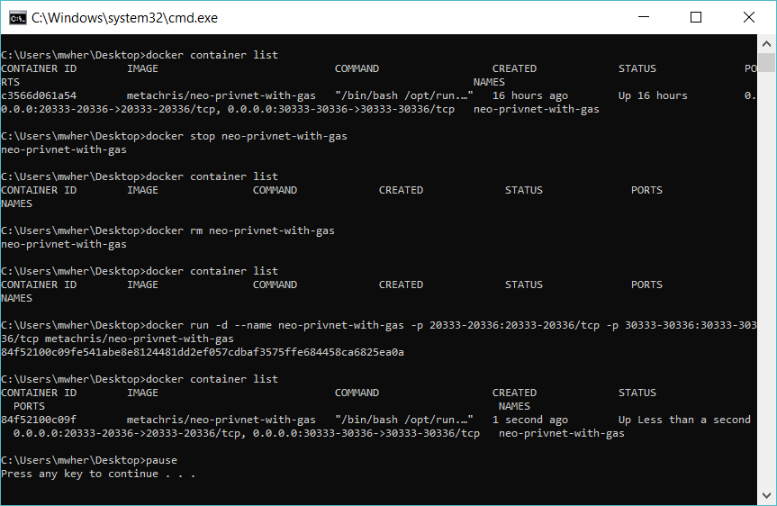
  
    Figure 9.1. NEO Docker Reset

## Test the NEO privatenet Docker Container

2. To test the NEO Docker container, run following script:
    ```
    REM cd opt/neo-python
    REM python3 prompt.py -p
    REM block 0
    docker exec -it neo-privnet-with-gas /bin/bash
    pause
    ```
    Script: NEO Docker Python CLI/Shell ([./scripts/neodockerpshell.bat.txt](./scripts/neodockerpshell.bat.txt))

    When the bash shell starts, enter the following commands:
    ```python
    cd opt/neo-python
    python3 prompt.py -p
    block 0
    ```
## Configure `neo-gui (developer)` to use the NEO privatenet Docker container

3. Open Windows Explorer and navigate to `C:\NEO\neo-gui-developer\neo-gui\bin` and right-click on the the `Debug` folder and delete it (and all of of the folder's contents). 

    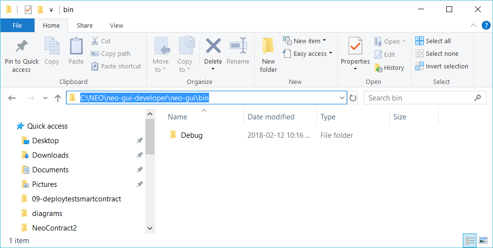

    Figure 9.2. C:\NEO\neo-gui-developer\neo-gui\bin

4. Navigate to `C:\NEO\neo-gui-developer`.

    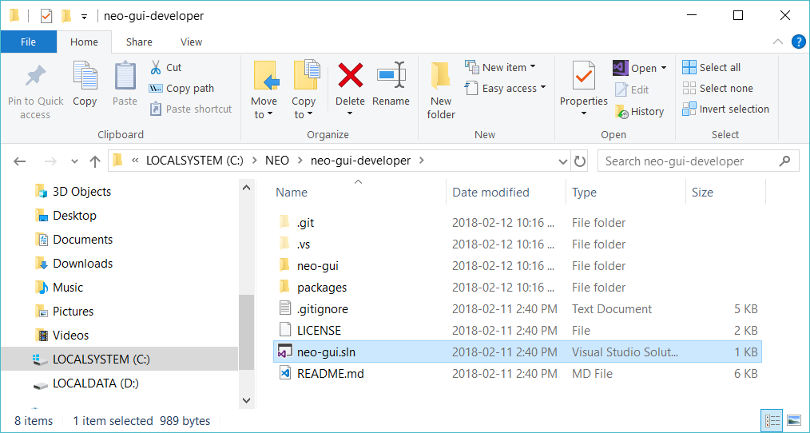

    Figure 9.3. C:\NEO\neo-gui-developer

5. Double-click `neo-gui.sln` to open the `neo-gui-developer` project in Visual Studio.

    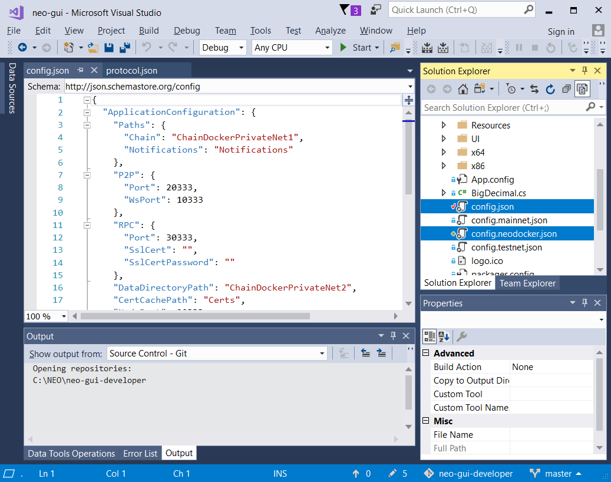

    Figure 9.4. Visual Studio: neo-gui project

6. In Visual Studio, replace the contents of `config.json` with the contents of `config.neodocker.json`.

    

    Figure 9.5. Visual Studio: config.json

    **NOTE:** If `config.neodocker.json` is not part of your project, you can download it from [here](./json/config.neodocker.json) ([./json/config.neodocker.json](./json/config.neodocker.json)) and place it in the `C:\NEO\neo-gui-developer\neo-gui` folder. Right-click on the `neo-gui` project folder in Visual Studio and select `Add` > `Existing Item...` > `*.*`. Select `config.neodocker.json` and click `Add`.

7. Similarly, replace the contents of `protocol.json` with the contents of `protocol.neodocker.json`.

    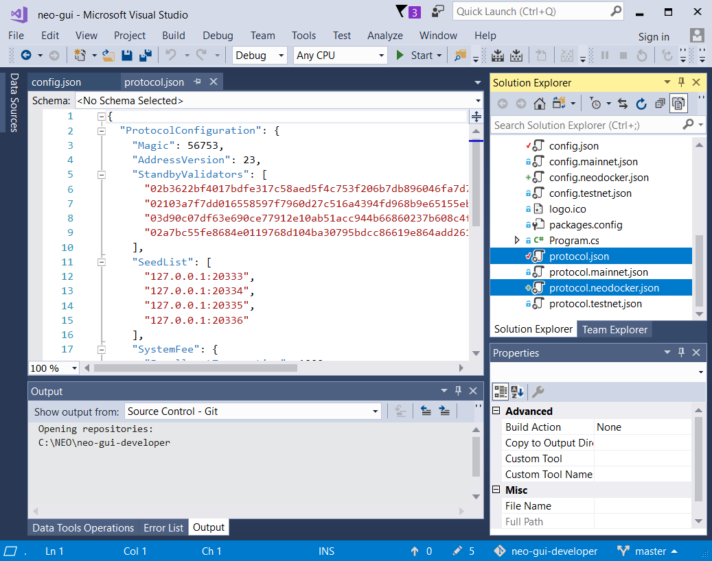

    Figure 9.6. Visual Studio: protocol.json

    **NOTE:** If `protocol.neodocker.json` is not part of your project, you can download it from [here](./json/protocol.neodocker.json) ([./json/protocol.neodocker.json](./json/protocl.neodocker.json)) and place it in the `C:\NEO\neo-gui-developer\neo-gui` folder. Right-click on the `neo-gui` project folder in Visual Studio and select `Add` > `Existing Item...` > `*.*`. Select `protocol.neodocker.json` and click `Add`.

8. In Visual Studio, click `Start` to rebuild and start `neo-gui`. It should starting syncing with the NEO privatenet Docker container.

    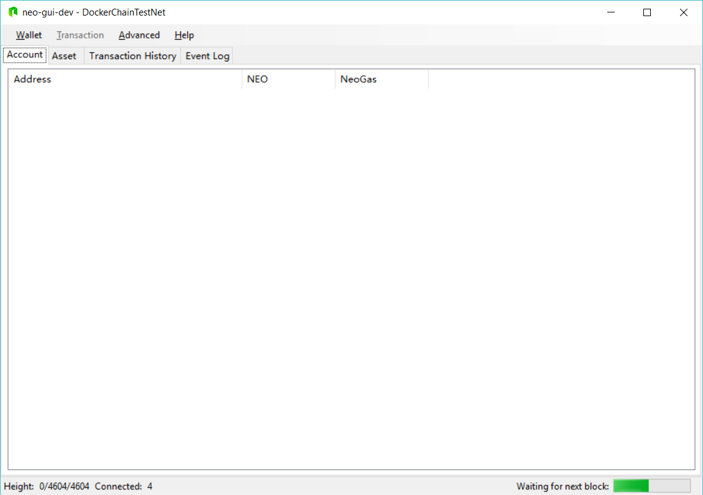

    Figure 9.7. neo-gui: Running against the NEO privatenet Docker container

    **NOTE:** If you made the optional code change in Activity 5 - Build and test NEO developer tool projects (from source), you will see the name of your NEO blockchain folder in the title bar (e.g. DockerChainTestNet).

## Create a new development wallet

9. From the `neo-gui` menu bar, click `Wallet` > `New Wallet Database...`.

    

    Figure 9.8. `neo-gui`: `Wallet` > `New Wallet Database...`

10. The following `New Wallet` dialog but will appear. Click `browse`.

    

    Figure 9.9. `neo-gui`: `New Wallet` dialog

11. Select a folder where you want your wallet to be created, enter the file name for the wallet database, and click `Save`.

    

    Figure 9.10. `neo-gui`: Wallet Location

    **NOTE:** Think of these as temporary development wallets that you will need to recreate every time you reset the NEO privatenet Docker container. There's no need to back them up.

    **NOTE:** A good suggestion is to include the name of the blockchain database folder that appears in `neo-gui` title bar (assuming you made this source code change in Activity 5) in the name of your wallet file.

    **NOTE:** The `neo-gui-developer` project only creates wallet databases using `.db3` format files (SQLLite database files). Other versions of `neo-gui` use JSON files. Note the difference.

12. Enter a password to protect your wallet. Confirm your password by re-entering into the second field.

    

    Figure 9.11. `neo-gui`: Wallet Password

13. The creation of your wallet is complete. One default account address has been created. 

    **NOTE:** This address will be different every time you create a new wallet.

    

    Figure 9.12. `neo-gui`: Wallet Created

## Import the existing Developer account from the NEO privatenet Docker container

14. To get some NEO/Gas, there is a preconfigured Developer account configured into the NEO private Docker container. To import this account, right-click on the newly created account and select `Import` > `Import from WIF...`.

    

    Figure 9.13. `neo-gui`: `Import` > `Import from WIF...`

15. The following `Import Private Key` dialog box will be displayed. 
Enter the WIF key provided in the NEO Docker container documentation [[NEODOCKER1](https://hub.docker.com/r/metachris/neo-privnet-with-gas/#Wallet)] and click `OK`. 
    ```
    WIF key: KxDgvEKzgSBPPfuVfw67oPQBSjidEiqTHURKSDL1R7yGaGYAeYnr
    ```

    

    Figure 9.14. `neo-gui`: `Import Private Key`

16. The result should be that you've created the following second account at address:
    ```
    Address: AK2nJJpJr6o664CWJKi1QRXjqeic2zRp8y
    ```

    **NOTE:** You may need to select `Wallet` > `Rebuild Index` for the non-zero NEO/Gas to appear next to the new account address.

    

    Figure 9.15. `neo-gui`: Second Address with NEO/Gas

## Deploy your smart contract (HelloWorld 1.0)

17. Open Visual Studio 2017 to create a new NEO smart contract project.

    

    Figure 9.16. Visual Studio 2017

18. Select `File` > `New` > `Project...` to open the New Project dialog box. Select `Visual C#`. Select `NeoContract`. Click `OK` to close this dialog box and create a new NeoContract solution and project in Visual Studio. 

    

    Figure 9.17. Visual Studio: Create a New NeoContract Project

    **NOTE:** If you have created previous NeoContract projects, your project may be called `NeoContract2`, `NeoContract3`, or whatever you chose to name the project.  Remember the project name and path because you will need to find the AVM file later on in this activity.

19. Visual Studio may take a few minutes to create the NeoContract project.

    

    Figure 9.18. Visual Studio: Creating the NeoContract Project

20. Right-click on the NeoContract project folder and select `Build`. Note the highlighted messages in the Build section of the Output panel. These 2 message indicate the Visual Studio was able to create both the NEO virtual machine byte code file as well as the Application Binary Interace (ABI) file (in JSON format).

    **NOTE:** If you don't see these 2 messages, the most likely senarios are:
      * `neon.dll` wasn't published properly. Go back to Task 6 of this activity.
      * The `Path` environment variable was not set correctly. Go back to Task 16 of this activity.
      * You had opened Visual Studio before you set the `Path` environment variable.  Close Visual Studio and then go back to Task 20.

    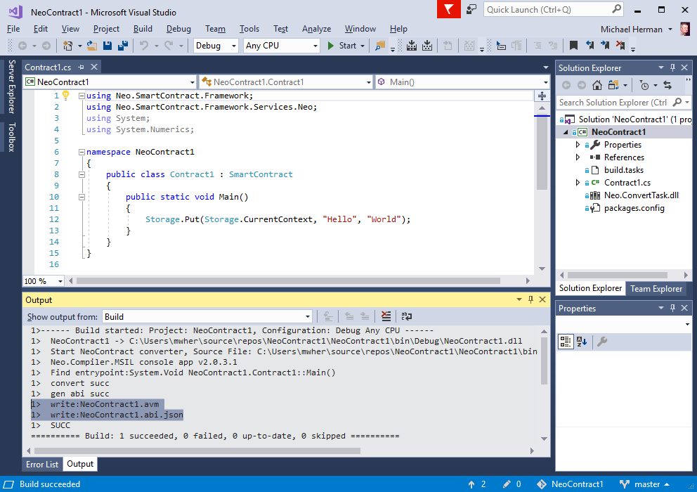

    Figure 9.19. Visual Studio: Building the NeoContract Project

## Deploy your first smart contract

21. From the `neo-gui`menu bar, select `Advanced` > `Deploy Contract...` to display the `Deploy Contact` dialog box.

    

    Figure 9.20. `neo-gui`: Deploy Contract Dialog Box

22. Enter the following information in the `Deploy Contract` dialog box.
* In the `Information` section, enter something appropriate for each field. These fields must be non-blank.
* In the `Return Type` section, leave these fields empty (for this particular smart contract).
* Click the `Need Storage` check box so that a check is displayed.
* Click `Load` to the AVM file created by your Visual Studio project (e.g. `C:\NEO\repos\NeoContract1\NeoContract1\bin\Debug\NeoContract1.avm`). . 

23. When the above information is complete, click `Deploy` on the `Deploy Contract` dialog box to complete the preparation steps for `neo-gui` to deploy the VM byte code for your contract. 

    The Script Hash will be displayed in the Script Hash dialog box. Click `copy` to have the script hash on the clipboard.

    

    Figure 9.21. `neo-gui`: Script Hash

    **NOTE:** The script hash is a hash of the VM byte code read in from your AVM (.avm) byte code file. This is the same script hash value that appears at the bottom of the `Deploy Contract` dialog box **after** you had loaded your AVM file.

    **NOTE:** If you forget to click `copy` to save a copy of the script hash to the clipboard, you can always retrieve the script hash value by reselecting `Advanced` > `Deploy Contract...` to display the `Deploy Contact` dialog box and reloading your AVM file. The script hash will appear near the bottom of the `Deploy Contract` dialog box. If all you need is the script hash, you don't need to complete the fields in the Information or Return Type sections. Click `Cancel` this time instead of Deploy.

    **NOTE:** If you haven't changed the code for your smart contract (and hence, the AVM file created by Visual Studio/neon will be the same), it will have the same script hash value. `neo-gui` doesn't create a new script hash value every time you deploy a smart contract. It only calculates a new hash value if the code for the smart contract has changed.

24. Immediately after you copy the script hash in the previous task, click `close` on the Script Hash dialog box to display the following `Invoke Contract` dailog.

    Click `Test` and then click `Invoke`. It is with these 2 actions that your smart contract will be deployed to the NEO privatenet.

    

    Figure 9.22. `neo-gui`: Invoke Contract Dialog Box

25. When the `Transaction successful` dialog box appears, click `close`. There is no need to copy of the transaction hash (TXID).

    

    Figure 9.23. `neo-gui`: Transaction Successful Dialog Box

26. In `neo-gui`, click on the `Transaction History` tab to see the list of transactions that have been executed on the NEO privaenet.

    **NOTE:** The first transaction is pending "unconfirmed" status; it has not been confirmed by the nodes on the blockchain.

    

    Figure 9.24. `neo-gui`: Transaction History

    You need to wait until the "unconfirmed" state changes to a number (e.g. 1).  In this case, some time has elapsed and 3 blocks have confirmed your most recent transaction.

    **NOTE:** Then you can click on the Event Log tab to see if your smart contract has called `Runtime.Notify()` or `Runtime.Log()` to post messages to the NEO Event Log.

    

    Figure 9.24. `neo-gui`: Transaction History

## Invoke your first smart contract

27. From the `neo-gui`menu bar, select `Advanced` > `Invoke Contract...` to display the `Invoke Contact` dialog box.

    Paste the script hash from the deployment tasks into the `ScriptHash` field. If you deployment was successful, the rest of the fields on the form should be filled with the values you entered on the `Deploy Contract` dialog box.

    **NOTE:** If the fields are blank, go back to Task 21 and start over. Pay particular attention to the instructions in Task 23.

    

    Figure 9.25. `neo-gui`: Invoke Contract Dialog Box

28. Click `Test` to invoke your contract. 

    

    Figure 9.26. `neo-gui`: Invoke Contract Dialog Box: Test

29. The results (return values) will appear in the text box at the bottom of the dialog. 

    **NOTE:** You may have to click it twice.

    

    Figure 9.27. `neo-gui`: Invoke Contract Dialog Box: Results

30. Returning to the `neo-gui` Account tab, you will notice the your NEO/Gas has been reduced.

    **NOTE:** 490 Gas is used to deploy a contract. 1 Gas is used to invoke a transaction.

    

    Figure 9.28. `neo-gui` Account Tab

## Create your second smart contract (HelloWorld 2.0)

31. Follow the pattern set out in the previous tasks to create a new NeonContract project (e.g. NeoContract2).

    **NOTE:** If you have created previous NeoContract projects, your project may be called `NeoContract3`, `NeoContract4`, or whatever you chose to name the project.  Remember the project name and path because you will need to find the AVM file later on in this activity.

32. Make a few changes to the default smart contract:
    * Change `Main()` to a accept a single integer parameter called `value`.
    * Add a `return value * 100;` statement to the end of `Main()`.

    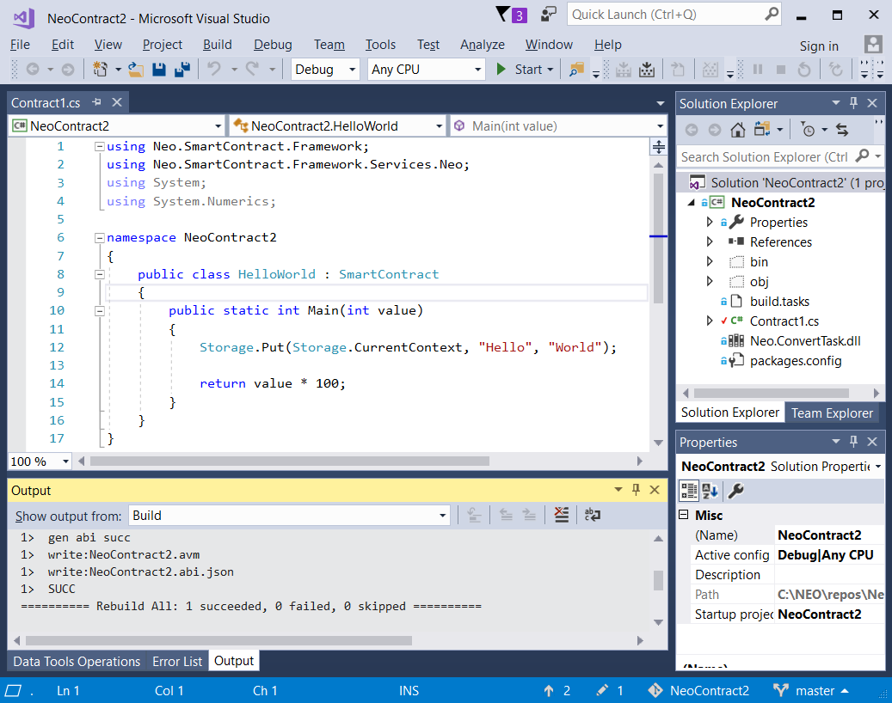

    Figure 9.29. HelloWorld 2.0 Smart Contract

    Your code should not look similar to the following:
    ```csharp
    using System;
    using System.Numerics;
    using Neo.SmartContract.Framework;
    using Neo.SmartContract.Framework.Services.Neo;

    namespace NeoContract2
    {
        public class HelloWorld : SmartContract
        {
            public static int Main(int value)
            {
                Storage.Put(Storage.CurrentContext, "Hello", "World!");

                return value * 100;
            }
        }
    }
    ```
    Code 9.1: HelloWorld 2.0

## Deploy your second smart contract

33. Follow the pattern set out in the previous tasks to deploy your HelloWorld 2.0 smart contract. Fill in the fields on the Deploy Contract dialog box.

    **NOTE:** On the `Deploy Contract` dialog box, in the `Return Type` section, you need to provide a string of 2-digit codes denoting the data type of:
    * Inbound parameters
    * Return value

    The data type codes for the parameters and return value can be found in the following table.
    
    Parameter/Return&nbsp;Type | Description |
    :--------|:---------------------- |
    Signature|00|
    Boolean|01|
    Integer|02|
    Hash160 (160-bit hash value)|03|
    Hash256 (256-bit hash value)|04|
    ByteArray, Object|05|
    PublicKey|06|
    String|07|
    Array|10|
    InteropInterface|f0|   
    Void|ff|
    Table 9.1: NEO Smart Contract Parameter/Return Types [[NEOPARMTYPES](http://docs.neo.org/en-us/sc/tutorial/Parameter.html)]

    For HelloWorld 2.0, you need to specify `02` and `02` for the single integer inbound parameter and the integer return value.

    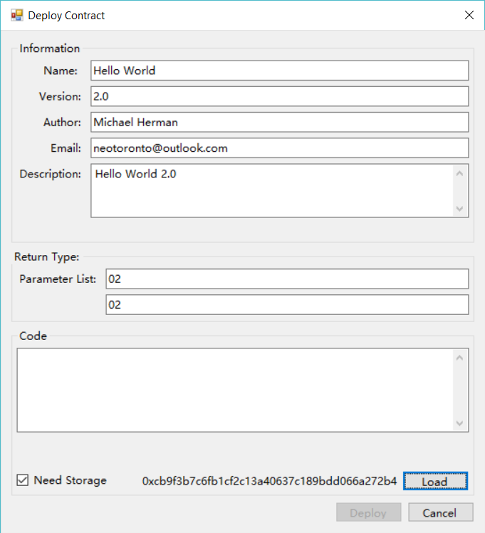

    Figure 9.30. HelloWorld 2.0: Deploy Contract

34. Load the AVM file for HelloWorld 2.0 and click `Deploy` on the `Deploy Contract` dialog box.

    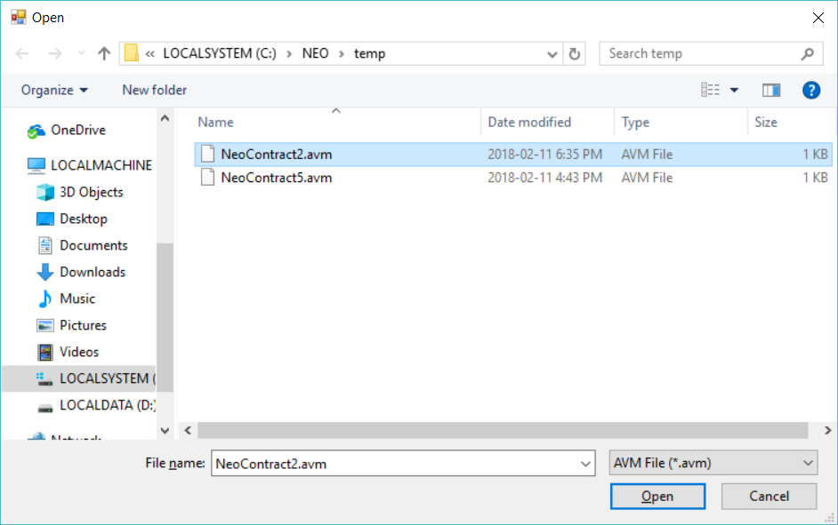

    Figure 9.31. HelloWorld 2.0: Load Contract

35. Copy the script hash value and click `close` on the `Script Hash` dialog box.

    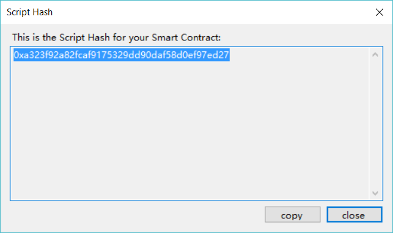

    Figure 9.32. HelloWorld 2.0: Script Hash

36. To complete the deployment, click `Test` and then `Invoke` on the `Invoke Contract` dialog box.

    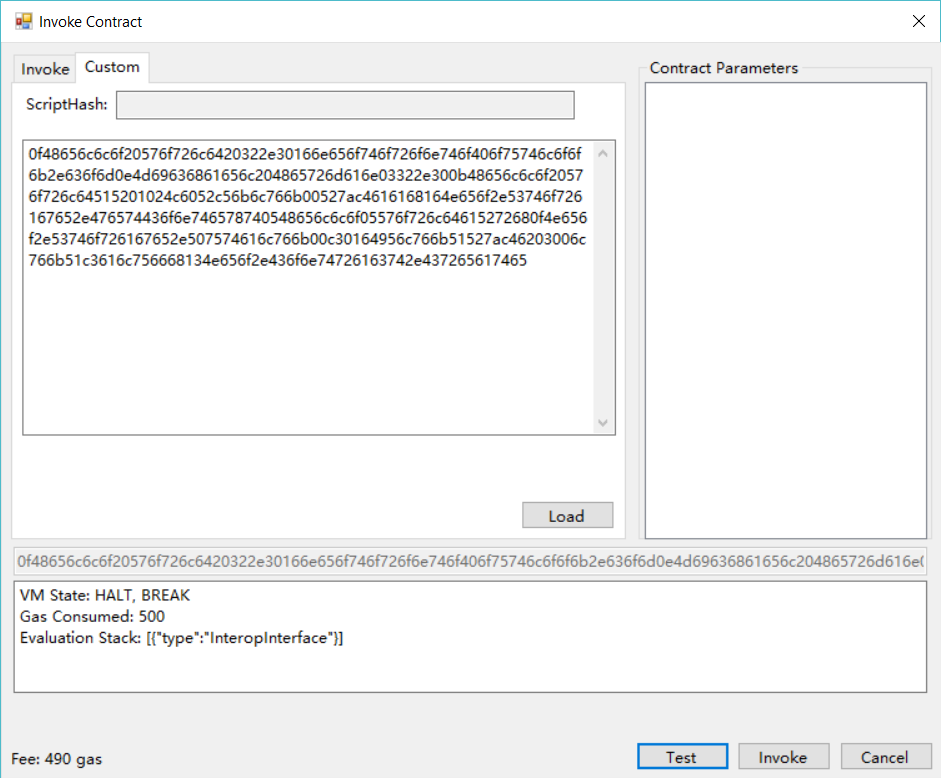

    Figure 9.33. HelloWorld 2.0: Complete Deployment

37. Deployment complete. Click `close`.

    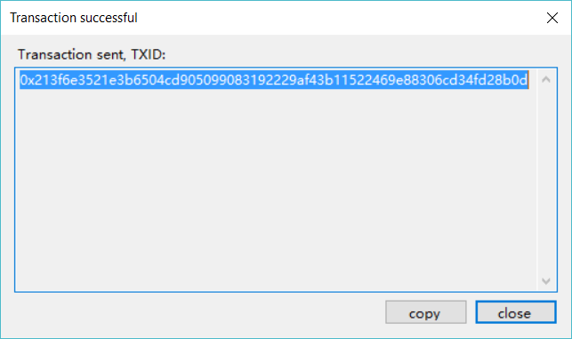

    Figure 9.34. HelloWorld 2.0: Deployment Complete

## Invoke your second smart contract

38. On the right-side of the `Invoke Contract` dialog box, in the `Contract Parameters` section, click on `Integer=(null)` to dislay the `Parameter Editor` dialog box. Enter `123` and click `Add`.

    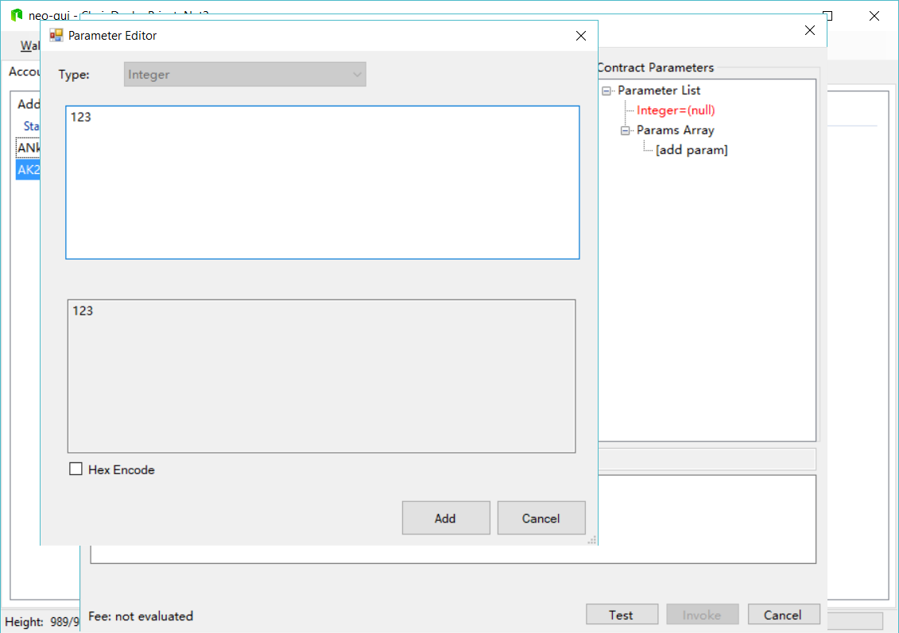

    Figure 9.35. HelloWorld 2.0: Parameters

39. Click `Test` to call your smart contract. The results (return value) will appear in the text box at the bottom of the dialog box.

    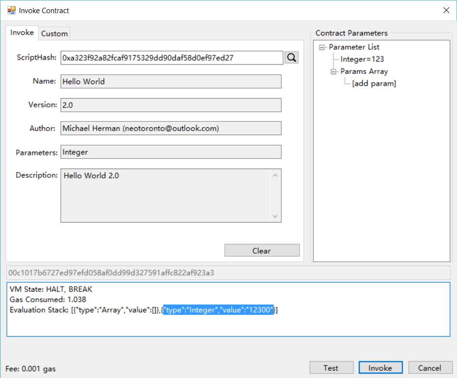

    Figure 9.36. HelloWorld 2.0: Test

40. To see the list of contracts you have deployed,dFrom the `neo-gui`menu bar, select `Advanced` > `List Contracts` to display the `Smart Contract Monitor` dialog box.

    

    Figure 9.37. `neo-gui`: Smart Contract Monitor

The tasks for this activity are complete. Proceed to [Activity 10 - Celebrate](./10-celebrate.md).

## Script Library

* NEO Docker Download/Install/Run ([./scripts/neodockerinstall.bat.txt](./scripts/neodockerinstall.bat.txt))
* NEO Docker Stop/Remove ([./scripts/neodockeruninstall.bat.txt](./scripts/neodockeruninstall.bat.txt))
* NEO Docker Start ([./scripts/neodockerstart.bat.txt](./scripts/neodockerstart.bat.txt))
* NEO Docker Stop ([./scripts/neodockerstop.bat.txt](./scripts/neodockerstop.bat.txt))
* NEO Docker Restart ([./scripts/neodockerrestart.bat.txt](./scripts/neodockerrestart.bat.txt))
* NEO Docker Reset ([./scripts/neodockerreset.bat.txt](./scripts/neodockerreset.bat.txt))
* NEO Docker Python CLI/Shell ([./scripts/neodockerpshell.bat.txt](./scripts/neodockerpshell.bat.txt))

## References

* [NEOTUTORIAL] NEO Project, [NEO smart contract tutorial](http://docs.neo.org/en-us/sc/tutorial.html) from [http://docs.neo.org/en-us/sc/tutorial.html](http://docs.neo.org/en-us/sc/tutorial.html)
* [NEODOCKER1] metachris, [metachris/neo-privnet-with-gas](https://hub.docker.com/r/metachris/neo-privnet-with-gas/) from [https://hub.docker.com/r/metachris/neo-privnet-with-gas/]https://hub.docker.com/r/metachris/neo-privnet-with-gas/()
* [NEOPARMTYPES] Neo Project, [Smart Contract Parameters and Return Values](http://docs.neo.org/en-us/sc/tutorial/Parameter.html) from [http://docs.neo.org/en-us/sc/tutorial/Parameter.html](http://docs.neo.org/en-us/sc/tutorial/Parameter.html)

## Other Good Resources

* [NEOPYTHONTUTORIAL] Nick Fujita, [NEO Smart Contracts Tutorial: helloWorld (Python)](https://steemit.com/neo/@z0yo/neo-smart-contracts-tutorial-helloworld) from [https://steemit.com/neo/@z0yo/neo-smart-contracts-tutorial-helloworld](https://steemit.com/neo/@z0yo/neo-smart-contracts-tutorial-helloworld)
* [NEOPYTHONTUTORIALVIDEO] Nick Fujita, [NEO Smart Contract Tutorial - Hello World (Python)](https://www.youtube.com/watch?v=9Ha_5RdOQrA) from [https://www.youtube.com/watch?v=9Ha_5RdOQrA](https://www.youtube.com/watch?v=9Ha_5RdOQrA)
* [NEOGUIDEVPULL38] Michael Herman. [Pull Request #38 to have the `config.neodocker.json` and `protocol.neodocker.json` files added to the `neo-gui-developer` project](https://github.com/CityOfZion/neo-gui-developer/pull/38) from [https://github.com/CityOfZion/neo-gui-developer/pull/38](https://github.com/CityOfZion/neo-gui-developer/pull/38)
