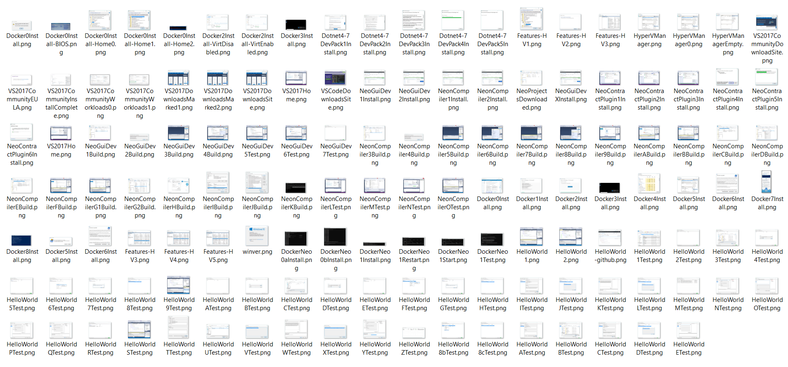

# NEO Blockchain Quick Start Guide for .NET Developers

NEO Blockchain Documentation for .NET Developers ([url](https://github.com/mwherman2000/neo-windocs/tree/master/windocs))

## Purpose

The purpose of this document is to enable .NET developers who are brand new to NEO Blockchain technology to create a useful NEO development environment and get it up and running in as little time as possible.

This document is specifically targeted at .NET developers and architects. 

### Caveat

In addition, when the first version of the document was written (February 2018), you will also need to have an [*early adopters*](https://en.wikipedia.org/wiki/Technology_adoption_life_cycle) mind set. It's the early days. You'll be downloading the code for most of the developer tools (aside from Visual Studio) and compiling them yourself. It may not always be fun but I promise it will certainly be rewarding in the end.

## Goals

* Ensure you have a working and properly configured NEO development environment up and running in as short a time as possible
* Enable to create, deploy and test your first NEO smart contract written in C# (using the HelloWorld sample)

## Principles

* Provide reliable documentation: timely, accurate, visual, and complete
* Save as much of a person's time as possible
* Use open source software whenever possible

## Drivers

* Need in the NEO .NET developer community to have concise and easy-to-follow documentation to enable people to get up to speed developing NEO smart contracts in as short a time as possible

## Sections

0. [Pre-requisites and Recommendations](./00-prerequisites.md)
1. [Download and install Visual Studio 2017 Community Edition integrated development environment (IDE)](./01-installvisualstudio.md)
2. [Download and unpack NEO developer tool projects (source)](./02-downloadneodevtoolsrc.md)
3. [Coffee time: Wait for previous activities to complete](./03-coffeetime-waitforprevactivities.md)
4. [Install NeoContractPlugin Visual Studio extension](./04-installvsneocontractplugin.md)
5. [Build and test NEO developer tool projects (from source)](./05-buildneodevtools.md)
6. [Download, install, and test Docker platform](./06-installdockerplatform.md)
7. [Download and test NEO privatenet Docker container](./07-installneoprivatenetcontainer.md)
8. [Create and compile HelloWorld smart contract sample](./08-createcompilesmartcontract.md)
9. [Deploy and test the HelloWorld smart contract](./09-deploytestsmartcontract.md)
10. [Celebrate](./10-celebrate.md)
11. [Appendix A - Checklist](./11-checklist.md)
12. [Appendix B - Roadmap](./12-roadmap.md)
13. [Appendix C - Reset NEO privatenet Environment: Container, Wallets, and Clients](./13-resetprivatenetenv.md)

## Statistics

* 10 major activities comprising 130 documented tasks (approximately)
* 140 screen shots (approximately)

    

    Figure 0.1. Quick Start Image Light Table
* 7 batch files
* 2 JSON configuration files
* 1 C# code snippet

## References

* [NEOTUTORIAL] NEO Project, [NEO smart contract tutorial](http://docs.neo.org/en-us/sc/tutorial.html) from [http://docs.neo.org/en-us/sc/tutorial.html](http://docs.neo.org/en-us/sc/tutorial.html)

## Other Good Resources

* [NEOPYTHONTUTORIAL] Nick Fujita, [NEO Smart Contracts Tutorial: helloWorld (Python)](https://steemit.com/neo/@z0yo/neo-smart-contracts-tutorial-helloworld) from [https://steemit.com/neo/@z0yo/neo-smart-contracts-tutorial-helloworld](https://steemit.com/neo/@z0yo/neo-smart-contracts-tutorial-helloworld)

## Feedback

>Awesome Mike!

